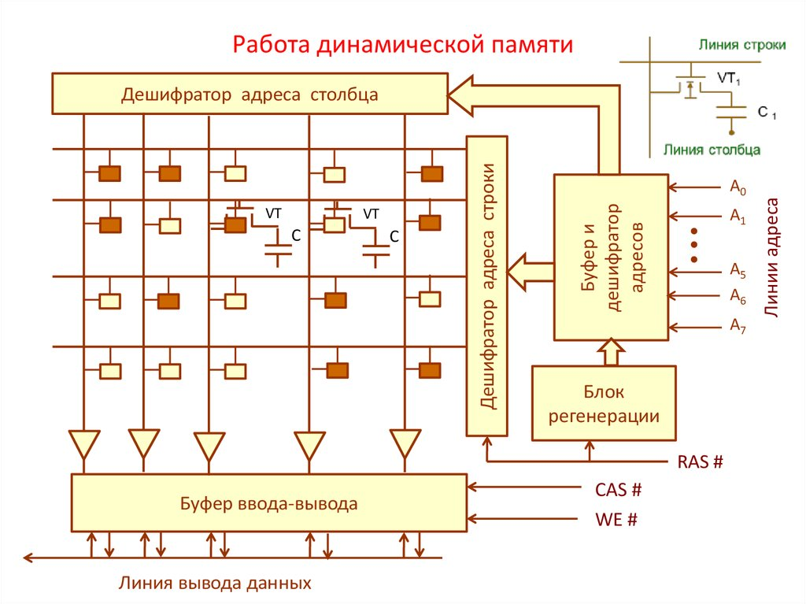

background-image: url(../img/title.svg)

---

background-image: url(../img/rec.svg)

---
background-image: url(../img/topic.svg)

.topic[Основы вычислительной техники]
.tutor[Алексей Семушкин]
.tutor_desc[Software Engineer at Semrush]

---

background-image: url(../img/rules.svg)

---

# О чем будем говорить:
- Физические основы
- Алгебра логики
- Элементарные компоненты
- Архитектуры вычислительной техники
- Устройство процессора, памяти, дисковой подсистемы
- Шины данных
- Синхронизация и прерывания

---

# Электрический сигнал

- ### **Электрический ток** — направленное и упорядоченное движение частиц — носителей электрического заряда. 

- ### **Электрическая цепь** - совокупность устройств, элементов, предназначенных для протекания электрического тока, электромагнитные процессы в которых могут быть описаны с помощью понятий сила тока и напряжение.

- ### **Электрический сигнал** – информация выраженная напряжением или током, проходящим по электрической цепи.

---

# Характеристики сигналов

Период — это отрезок времени, через который сигнал начинает повторяться.  
Это временное значение также называют временем периода для синусоид или шириной импульса для меандров и обозначают буквой T.
 
 
 

.center-image[

]

---

# Характеристики сигналов

Частота является величиной, обратной периоду времени, (T).  
Единицей измерения частоты является Герц (Гц).
 
 
 

.center-image[

]

---

# Характеристики сигналов

Амплитуда — это величина изменения сигнала.  
Измеряется в Вольтах (В) или Амперах (А), в зависимости от того, какую временную зависимость (напряжения или тока) мы используем.
 
 
 

.center-image[

]

---

# Типы сигналов

.full-image[

]

---

# Типы сигналов

- ### Цифровой сигнал — сигнал, который можно представить в виде последовательности дискретных (цифровых) значений.
- ### Битовый поток - двоичные цифровые сигналы, широко используются в двоичной электронике. 

---

# Понятие бита

## Бит - наименьшая единица измерения информации. 
---

# 1 бит информации это

- Включено или выключено
- Да или нет
- Высокая или низкая амплитуда
- Заряженный или незаряженный

## В двоичной системе исчисления это 1 (единица) или 0 (ноль).

---

# Как бит выглядит для компьютера?

.left-image.onefour-image[
    
]

.right-image.threefour-image[
    
]

---

# Логический элемент НЕ

.center-image[
    
]

---

# Логический элемент И

.center-image[
    
]

---

# Логический элемент ИЛИ

.center-image[
    
]

---

# Логический элемент исключающее ИЛИ

.center-image[
    
]

---

# Логический элемент И-НЕ/ИЛИ-НЕ

.left-image[
    
]

.right-image[
    
]

---

# Схемная реализация

- https://elenergi.ru/logicheskie-elementy-i-ix-sxemnaya-realizaciya.html

---

# Триггеры

Триггер — класс электронных устройств, обладающих способностью длительно находиться в одном из двух устойчивых состояний и чередовать их под воздействием внешних сигналов.

 

.center-image.threefour-image[
    
]

---

# Виды триггеров

- RS-триггер асинхронный
- RS-триггер синхронный

- D-триггер синхронный
- D-триггер двухступенчатый

- Т-триггер асинхронный
- T-триггер синхронный

- JK-триггер

---

# Элементная база ВТ

- Регистры - устройства, выполняющие функции приема, хранения, передачи и преобразования информации. Выполненняются на основе D-триггера.

- Счетчики – устройства, на выходах котороых получается двоичный (двоично-десятичный) код, определяемый числом поступивших импульсов. Счетчики строятся на Т-триггерах.

- Мультиплексоры – функциональные узлы, осуществляющие подключение (коммутацию) одного из нескольких входов данных к выходу. 

- Шифраторы — это комбинационные устройства, преобразующии десятичные числа в двоичную систему счисления.

- Дешифраторы - выполняют обратную шифраторам функцию.

---

# Архитектура ВТ

### Архитектура – логическая организация, структура и ресурсы вычислительной системы.

### По типу применяемого процессора
- CISC (англ. complex instruction set computing)
- RISC (англ. reduced instruction set computing)
- MISC (англ. minimal instruction set computing)
- VLIW (англ. very long instruction word)

### По принципу разделения памяти
- Гарвардская архитектура — характерной чертой является разделение памяти программ и памяти данных
- Фон Неймановская архитектура — характерной чертой является совместное хранение программ и данных

---

# Архитектура Фон Неймана

- Использование двоичной системы счисления в вычислительных машинах. 
- Программное управление ЭВМ.
- Память компьютера используется не только для хранения данных, но и программ.
- Ячейки памяти ЭВМ имеют адреса, которые последовательно пронумерованы.
- Возможность условного перехода в процессе выполнения программы.

---

# Архитектура Фон Неймана

.center-image.threefour-image[
    
]

---

# Устройство процессора

- Арифметико-логическое устройство
- Регистры
- Устройство выборки и управления
- Тактовый генератор

---

# Устройство процессора

.center-image.threefour-image[
    
]

---

# Устройство процессора

.center-image.half-image[
    
]

---

# Прерывания

### Прерывание — одна из базовых концепций вычислительной техники, которая заключается в том, что при наступлении какого-либо события происходит передача управления специальной процедуре, называемой обработчиком прерываний

- Асинхронные, или внешние (аппаратные)
- Синхронные, или внутренние
- Программные (частный случай внутреннего прерывания) 

---

# Иерархия памяти

.center-image.threefour-image[
    
]

https://i2hard.ru/publications/24825

---

# RAM

- Произвольный доступ
- Не персистентна
- Логически состоит их ячеек, каждая из которых имеет свой собственный адрес.
 

Принято выделять два вида оперативной памяти: статическую (SRAM) и динамическую (DRAM).

---

# Устройство DRAM

.center-image.threefour-image[
    
]

---

# Шины

Шина - соединение, служащее для передачи данных между функциональными блоками компьютера.

.center-image.threefour-image[
    
]

---

# Шина данных

- Предназначенная для передачи данных (команд и операндов) между компонентами компьютера.
- Ширина определяет количество информации, которое можно передать за один такт.

---

# Шина адреса

- Передает адресную информацию.
- Ширина равна разрядности процессора.
- Используется центральным процессором или устройствами, способными инициировать сеансы прямого доступа к памяти.

---

# Шина управления

- Передает сигналы, определяющие характер обмена информацией по магистрали (считывание или запись, синхронизация и т.д.)

---

# Дисковая подсистема

- Шина данных
- Дисковый контроллер
- Накопители (HDD, SSD, NVMe)

---

# Полезные ссылки

- https://inf1.info/machineneumann 
- https://intuit.ru/studies/courses/3481/723/lecture/14244?page=2
- https://i2hard.ru/publications/24825
- https://prog-cpp.ru/micro-interrupts/
- https://pyatilistnik.org/difference-between-physical-cores-and-logical-processors/

---

background-image: url(../img/questions.svg)

---

background-image: url(../img/poll.svg)

---

background-image: url(../img/next_webinar.svg)
.announce_date[9 августа]
.announce_topic[Работа с ОС Linux]

---
background-image: url(../img/thanks.svg)

.tutor[Алексей Семушкин]
.tutor_desc[Software Engineer at Semrush]
