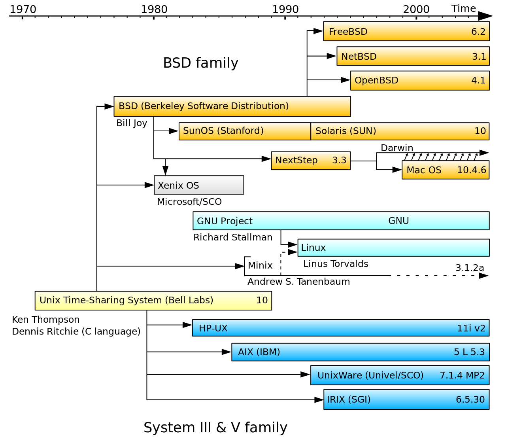
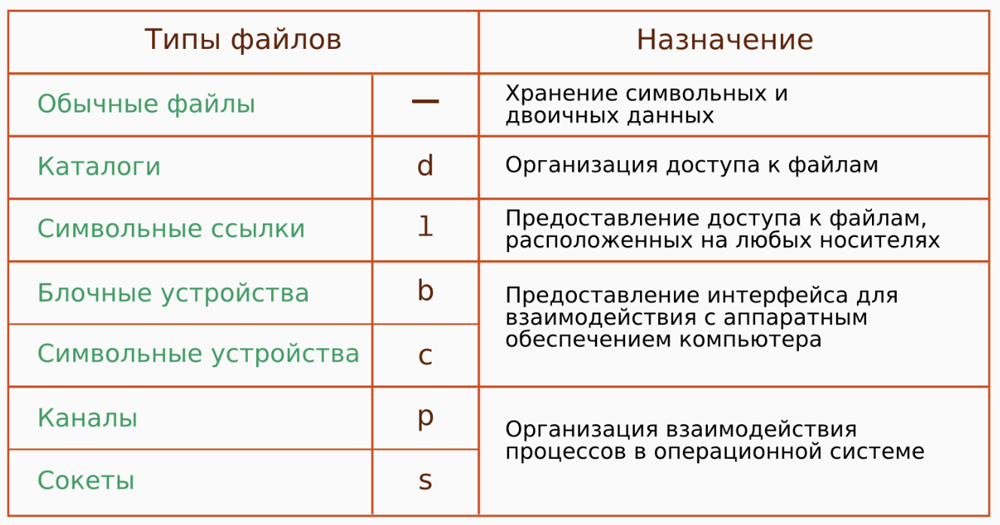
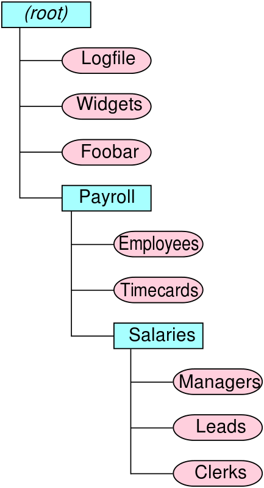

background-image: url(../img/title.svg)

---

background-image: url(../img/rec.svg)

---
background-image: url(../img/topic.svg)

.topic[Работа с ОС Linux]
.tutor[Алексей Семушкин]
.tutor_desc[Software Engineer at Semrush]

---

background-image: url(../img/rules.svg)

---

# О чем будем говорить:

- Зачем нужна операционнная система
- Архитектура и семейства ОС
- UNIX
- Что такое Linux
- Дистрибутивы
- Понятия каталога, файла, процесса, потока
- Терминал, пакетные менеджеры, консольные утилиты

---

# Для чего нам вообще нужна ОС?

---

# Для чего нам вообще нужна ОС?

- ### Управление и контроль аппаратного обеспечения
- ### Управление и контроль программного обеспечения 
- ### Обеспечение взаимодействие между пользователем и компьютером

---

# Предпосылки создания ОС

- ### Пакетный режим
- ### Разделение времени и многозадачность
- ### Разделение полномочий
- ### Файловые системы и структуры (замена устройств последовательного доступа)

---

# Семейства ОС

- ### Windows
- ### UNIX

---

# UNIX

### Cемейство переносимых, многозадачных и многопользовательских операционных систем, которые основаны на идеях оригинального проекта AT&T Unix, разработанного в 1970-х годах в исследовательском центре Bell Labs Кеном Томпсоном, Деннисом Ритчи и другими.

---
# UNIX

- Простая метафорика (два ключевых понятия: вычислительный процесс и файл);
- Компонентная архитектура: принцип «одна программа — одна функция» плюс мощные средства связывания различных программ для решения возникающих задач («оболочка» + конвейеры);
- Минимизация ядра (кода, выполняющегося в «реальном» (привилегированном) режиме процессора) и количества системных вызовов;
- Независимость от аппаратной архитектуры и реализация на машиннонезависимом языке программирования (язык программирования Си стал побочным продуктом разработки UNIX);
- Унификация файлов.

---

# Архитектура UNIX

.right-image[

]

- ### Kernel
- ### Shell
- ### Commands and Utilities
- ### Files and Directories

---

# UN*X

.center-image.threefour-image[

]

---

# Что такое Linux 

- Linux – семейство UNIX-like операционных систем с открытым исходным кодом
- В основном ядро написано на C, с некоторыми вставками ассемблера
- OC поддерживает многозадачность, виртуальную память, динамические библиотеки, множество сетевых протоколов
- Не имеет географического центра разработки
- Работает на огромном количестве архитектур
- На 100 % суперкомпьютеров из рейтинга TOP500 установлен Linux. 

---

# Дистрибутивы Linux

### Дистрибутив GNU/Linux — общее определение операционных систем, готовых для конечной установки на пользовательское оборудование

- Как правило содержит ядро Linux
- Как правило содержит набор библиотек и утилит, выпускаемых в рамках проекта GNU
- Может содержать графический сервер (X или Wayland)

---

# Дистрибутивы Linux

- ### Ubuntu
- ### Debian
- ### Fedora
- ### Mint
- ### Arch
- ### Gentoo

---

# Терминал

- Это программа, которая используется для взаимодействия с командной оболочкой. 
- Другое название — командная строка. 
- Терминал предназначен для администрирования ОС: установки и удаления программ, работы с файловой системой и др. 
- Открыть окно терминала можно с помощью комбинации клавиш Ctrl + Alt + T.

---

# 2 самых важных понятия

- ## Процесс
- ## Файл

---

# Процесс

### Процесс — это программа, загруженная в память со всеми необходимыми ресурсами
### Представлен в ядре как обычная структура с множеством полей. Важными для нас являются: 
- Идентификатор процесса (pid)
- Открытые файловые дескрипторы (fd)
- Обработчики сигналов (signal handler)
- Текущий рабочий каталог (cwd)
- Переменные окружения (environ)
- Код возврата

### Каждый процесс имеет как минимум один поток.

---

# Жизненный цикл процесса

- Создание
- Готов
- Выполняется
- Ожидает
- Остановлен
- Завершение
- Зомби

---

# Поток

### Поток (thread) — это сущность операционной системы, процесс выполнения на процессоре набора программных инструкций.
### Основное назначение - одновременное выполнение на процессоре множества задач (многозадачность).
Каждый поток (также как и процесс) имеет свой контекст, содержащий в себе информацию о
- Регистрах процессора
- Указателе на стек процесса/потока

---

# Пара слов о планировщике

- Определяет какой процесс должен быть обработан процессором
- Обеспечивает многозадачность
- Обеспечивает утилизацию процессора
- Стремится минимизировать время ожидания процесса
- Стремится максимизировать пропускную способность

---

# Файл

## В Linux все есть файл

---

# Файл

- Linux чувствителен в регистру
- Скрытые файлы начинаются с точки
- Система не следит за расширениями файлов
- Тип файла - скорее тип объекта, а не тип данных (в отличие от Windows)

---

# Типы файлов

.center-image.threefour-image[

]

---

# Файловый дескриптор

## Неотрицательное число, которое является идентификатором потока ввода-вывода. 

- 0 — стандартный ввод (stdin)
- 1 — стандартный вывод (stdout)
- 1 — стандартный вывод (stdout)

---

# Атрибуты файлов

- Набор свойств в файловой системе (права доступа, владелец, имя, метки времени)
- Права доступа - это набор из девяти битов, определяют какие из пользователей обладают правами на чтение, запись и исполнение.
- Редактировать можно с помощью утилиты `chattr`

---

# Файловая система и каталог

.right-image.onefour-image[

]

- Файловая система - порядок, определяющий способ организации, хранения и именования данных.
- Файловая система связывает носитель информации с одной стороны и API для доступа к файлам — с другой.
- Практически всегда файлы на дисках объединяются в каталоги.
- Каталог — объект в файловой системе позволяющий сгруппировать файлы и, возможно, другие каталоги. 

---

# Каталоги в Linux

- / — корень
- /bin — бинарные файлы пользователя
- /sbin — системные исполняемые файлы
- /etc — конфигурационные файлы устрановленных программ
- /dev — файлы устройств
- /proc — информация о процессах
- /var — переменные файлы
- /tmp — временные файлы, созданные пользователем или системой
- /usr — программы пользователя
- /home — домашняя папка
- /boot — файлы загрузчика
- /lib — системные библиотеки
- /opt — дополнительные программы (проприетарные)
- /sys — информация о системе

---

# Команды

Обычно команды в Linux имеют следующий синтаксис:
</br></br>

<команда> <функция> <-флаги> <аргумент>
</br></br>

- команда — действие, которое нужно выполнить;
- функция — дополнительные условия выполнения команды;
- флаги - дополнительные модификаторы поведения;
- аргумент — файл или программа, с которой нужно выполнить действие.

## man - ваш главный помощник

---

# Навигация и базовые команды

```
cd
clear
pwd
man
sudo
alias
```

---

# Работа с файлами 

```
ls
touch ~/directory/file_name
cat ~/directory/file
chmod file_name
chown file_name
file file_name
vi ~/directory/file_name.txt
mv ~/directory/file ~/directory/file2
cp ~/directory/file ~/directory/file2
mkdir ~/directory/ 
rm ~/directory/file
```

- Используйте tab для автокомплита

---

# Управление системой

```
df/du
free
uname
uptime
whoami
```

---

# Пакетные менеджеры (Ubuntu/Debian)

```
apt update
apt upgrade
apt-add-repository repository_address
apt install package_name
apt remove package_name 
apt purge package_name
```

---

# TUI

```
mc
tmux
k9s
```

---

# Полезные ссылки

- https://www.softwaretestinghelp.com/unix-vs-linux/
- https://habr.com/ru/articles/40227/
- https://younglinux.info/bash/filestype
- https://timeweb.com/ru/community/articles/chto-takoe-faylovyy-deskriptor-prostymi-slovami

---

background-image: url(../img/questions.svg)

---

background-image: url(../img/poll.svg)

---

background-image: url(../img/next_webinar.svg)
.announce_date[14 августа]
.announce_topic[Работа с Git]

---
background-image: url(../img/thanks.svg)

.tutor[Алексей Семушкин]
.tutor_desc[Software Engineer at Semrush]
