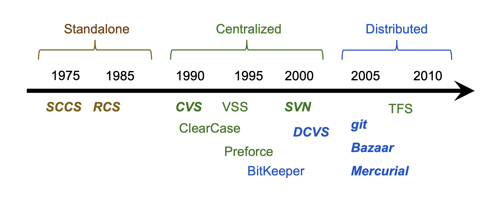
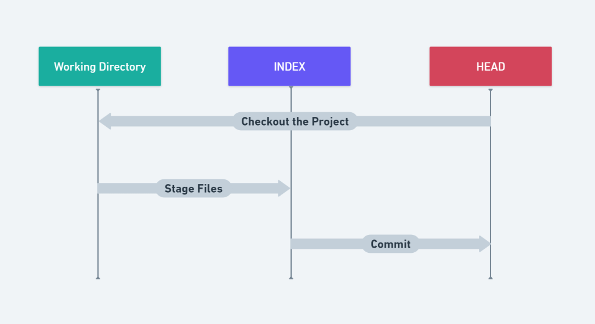
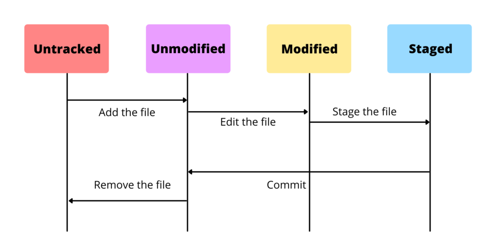
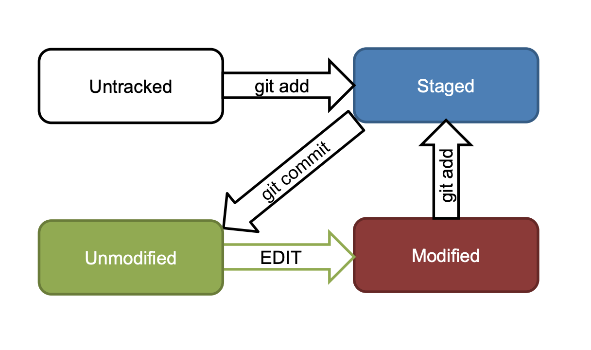
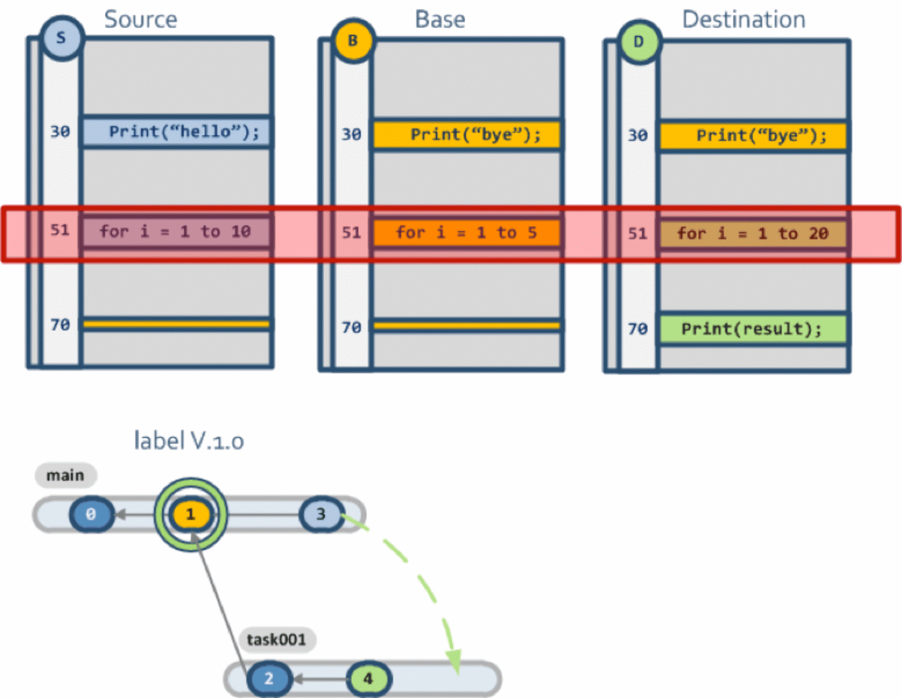
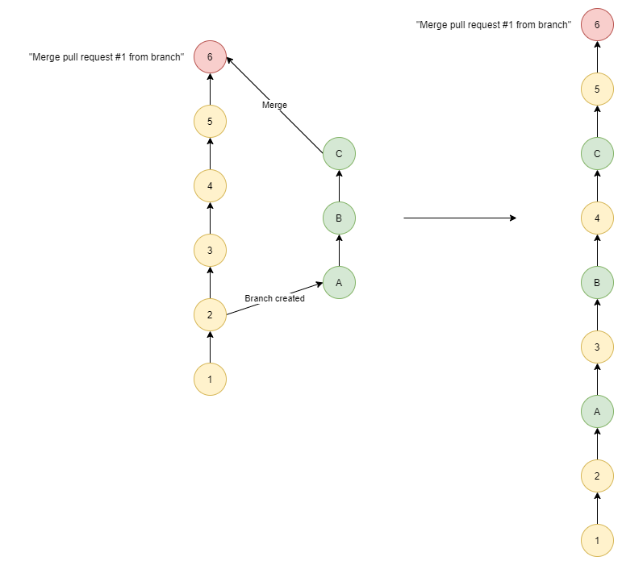
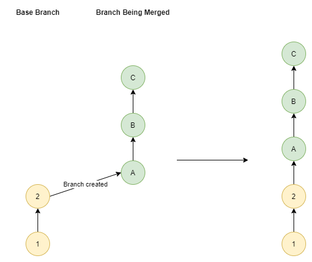
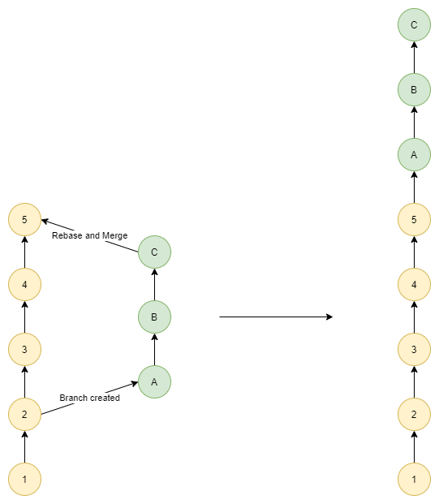
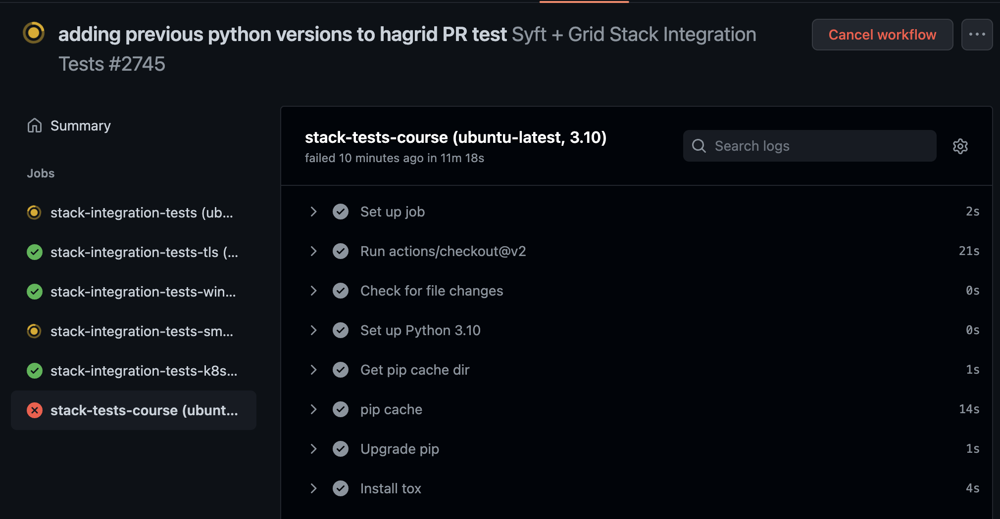

background-image: url(../img/title.svg)

---

background-image: url(../img/rec.svg)

---
background-image: url(../img/topic.svg)

.topic[Работа с Git]
.tutor[Алексей Семушкин]
.tutor_desc[Software Engineer at Semrush]

---

background-image: url(../img/rules.svg)

---

# О чем будем говорить:

- Система контроля версий Git
- Базовые команды Git 
- Расширенные команды Git
- GitHub/GitLab и пайплайны

---

# Что такое Git

## Git — система управления версиями (VCS) с распределенной архитектурой.

---

# Что такое Git

### Система Git была изначально разработана в 2005 году Линусом Торвальдсом — создателем ядра операционной системы Linux. 
### Git применяется для управления версиями в рамках колоссального количества проектов по разработке ПО, как коммерческих, так и с открытым исходным кодом.

---

# Что такое Git

https://git-scm.com/

---

# VCS

.center-image.threefour-image[

]

### VCS позволяют хранить несколько версий одного и того же файла, возвращаться к более ранним версиям, отслеживать изменения
### Как этого можно добиться?

---

# 3 дерева

.center-image.threefour-image[

]

---

# Состояния файла

.center-image.threefour-image[

]

---

# Инициализация репозитория

### `git init` - создание пустого локального репозитория
### `git remote ...` - работа c upstream репозиторием (добавление/удаление/переименование)
### `git clone` - клонирование удаленного репозитория

---

# Работа с INDEX 

### `git add filename` - добавление измененных файлов в stage
### `git rm filename` - пометка файла как удаленного из stage
### `git reset ref` - сбрасывает stage к состоянию из локального репозитория, staged изменения сохранятся

---

# Работа с HEAD

### `git commit` - сохранение текущего stage в локальный репозиторий
### `git commit --amend` - перезапись файла в локальном репозитории (пересоздание коммита)
### `git reset ref --hard` - сбрасывает stage и рабочую директорию к указанному состоянию из локального репозитория

---

# Еще раз про состояния файла

.center-image.threefour-image[

]

---

# Работа с удаленным репозиторием

### `git clone` - клонирование удаленного репозитория
### `git push` - отправление изменений в удаленный репозиторий
### `git fetch` - забирает все изменения из удаленного репозитория в локальный (не в рабочий каталог)
### `git pull` - забирает изменения указанной ветки из удаленного репозитория и сливает их в текущую ветку

---

# Ветки

### `git branch` - работа с ветками
### `git checkout` - переключение рабочей копии на другую ветку
### `git checkout -b` - создание новой ветки из текущей и переключение на нее

- По сути всего лишь указатели на определенные коммиты
- Нужны для разработки нового функционала без риска сломать работающий код

---

# Слияние веток

.center-image.threefour-image[

]

---

# Слияние веток

.center-image.threefour-image[

]

 
Но что будет, если изменения в ветках противоречат друг другу?

---

# Three-way merge

.center-image.threefour-image[

]

---

# Merge no fast-forward

.center-image.threefour-image[

]

---

# Merge fast-forward

.center-image.threefour-image[

]

---

# Merge squash

.center-image.threefour-image[

]

---

# Rebase

.center-image.half-image[

]

---

# Еще пара слов про pull

- Забирает изменения с удаленного репозитория
- Сливает их с изменениями в локальном репозитории
- Может использовать разные стратегии слияния
- Зачастую приходится решать конфликты

---

# Временное хранилище (stash)

### `git stash` - помещает изменения из stage во временное хранилище и сбрасывает рабочую копию

---
# GitHub и GitLab

- Платформы для онлайн-хостинга репозиториев
- Если Git - инструмент, то GitHub и GitLab - сервисы для удобной работы с ним
- Занимают практически девяносто процентов всего рынка
 
 
- https://github.com/
- https://about.gitlab.com/

---

# Pull Requests

.center-image.threefour-image[

]

---

# GitHub Actions

.center-image.threefour-image[

]
 
 
- https://docs.gitlab.com/ee/ci/

---

# GitLab CI

.center-image.threefour-image[

]
 
 
- https://github.com/features/actions

---

background-image: url(../img/questions.svg)

---

background-image: url(../img/poll.svg)

---

background-image: url(../img/next_webinar.svg)
.announce_date[16 августа]
.announce_topic[Инструментарий языка и организация проекта на Go]

---
background-image: url(../img/thanks.svg)

.tutor[Алексей Семушкин]
.tutor_desc[Software Engineer at Semrush]
