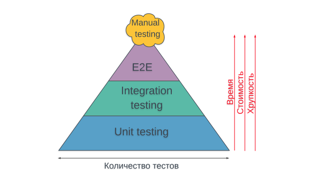

background-image: url(../img/title.svg)

---

background-image: url(../img/rec.svg)

---
background-image: url(../img/topic.svg)

.topic[Тестирование в Go]
.tutor[Романовский Алексей]
.tutor_desc[Разработчик GO в компании Resolver Inc.]

---

background-image: url(../img/rules.svg)

---
# Краткое содержание

* тесты и для чего они нужны;
* пирамида тестирования;
* декомпозиция кода;
* понятие табличных тестов;
* пакет testing и библиотека testify;

---

# Зачем нужны тесты?
###(Вопрос аудитории)

* Напишите ваше мнение в чат
* или просто "-"

---
# Зачем нужны тесты?

* Упрощают рефакторинг.
* Документируют код.
* Отделение интерфейса от реализации (mocks), менее связный код.
* Помогают найти неактуальный код.
* Помогают найти новые кейсы.
* Считают метрику для менеджмента (покрытие).
* Определяют контракт.
* Повышают качество кода.
* Придают уверенности при деплое в продакшен.

---

# Пирамида тестирования

Есть разные виды тестирования:
* Юнит-тесты (Unit-tests)
* Интеграционные тесты (Integration)
* Системные тесты (End-to-End, GUI)
* Ручное тестирование (Manual)

.center[]

Так же упомянем (но не рассматриваем сегодня):
* Нагрузочное тестирование
* Тестирование безопасности
* Тестирование производительности

---

# Декомпозиция кода

Мы проектируем код, разбивая его на маленькие части: ..., слои, пакеты, функции, ... 


Тестирование должно быть встроено в этот процесс.

<br>
* какие тесты покроют эту часть кода?
* как изменить декомпозицию, чтобы использовать более дешёвый вид тестирования для данного модуля?


---
# Какие тесты писать, как их придумывать?

* Позитивный сценарий
    * убедитесь что компонент работает в случае, когда получил корректные и наиболее типичные данные.
    * в том числе, при вызове из разных потоков
* Негативный сценарий
    * Проверьте что неверные денные вызывают ошибку и не приводят к нежелательным последствиям (таких как запись в бд, отправка их дальше)
* Граничные случаи
    * Самое большое/маленькое/длинное/короткое/**пустое** значение аргументов
    * границы, на которых меняется поведение
* "А что если..."
    * кейсы, которые могут появиться в будущем
    * неожиданные данные, о которых вы знаете как автор кода, но обычно их слать не должны


---

# Тест в Go

```
strings_test.go // <-- ..._test.go
```

```
func TestIndex(t *testing.T) { // <-- Test...(t *testing.T)
    const s, sub, want = "chicken", "ken", 4
    got := strings.Index(s, sub)
    if got != want {
        t.Errorf("Index(%q,%q) = %v; want %v", s, sub, got, want)
    }
}
```

### Пример: https://goplay.space/#yybc8Np1JjK

### Ссылки:
* https://pkg.go.dev/testing
* https://gobyexample.com/testing-and-benchmarking


---

# testing: Error vs Fatal

* тест не останавливается при ошибке t.Fail, t.Error*
* тест останавливается при t.Fatal, t.FailNow

Давайте сломаем первую проверку в тесте и потом попробуем там FailNow:
```go
func TestAtoi(t *testing.T) {
	const str, want = "42", 42
	got, err := strconv.Atoi(str)
	if err != nil {
		t.Errorf("strconv.Atoi(%q) returns unexpected error: %v", str, err)
	}
	if got != want {
		t.Errorf("strconv.Atoi(%q) = %v; want %v", str, got, want)
	}
}
```

### Пример: https://goplay.space/#vjAsrBrQrxu

### Ссылки:
* https://pkg.go.dev/testing#T

---

# testing: практика

## Пакет TitleCase
* "github.com/kulti/titlecase"
* Делает слова в строке с большой буквы.
* Кроме слов из второй строки.
* Первое слово всегда с большой буквы.
* Большие буквы внутри слов меняются на маленькие.

Пример:

<br/>

* `TitleCase("the quick fox in the bag", "")` -> `"The Quick Fox In The Bag"`
* `TitleCase("the quick fox in the bag", "in the")` -> `"The Quick Fox in the Bag"`

---

# testing: практика

## Задание
* ### Дописать существующие тесты.
* ### Придумать один новый тест.
* ### Не закрывайте playground — еще пригодится :)

<br>
### Код: https://goplay.space/#PQCd4_FqLeZ

---

# testify: assert vs require

* assert — продолжает тестирование при ошибке
* require — останавливает тестирование при ошибке

```go
import (
	"encoding/json"
	"testing"

	"github.com/stretchr/testify/assert"
	"github.com/stretchr/testify/require"
)

func TestJson(t *testing.T) {
	input := `{"a":"hello","b":"world"}`
	result := struct {
		A string
		B string
	}{}
	err := json.Unmarshal([]byte(input), &result)
	require.NoError(t, err)
	assert.Equal(t, result.A, "hello")
	assert.Equal(t, result.B, "world")
}
```
---

# testify: возможности

* очень много разных assert'ов, выбырайте как можно более конкретный
    * assert.True(t, result.A == "hello") // плохо
    * assert.Equal(t, result.A, "hello") // хорошо
    * assert.Contains(t, err.Error(), "not found") // плохо
    * assert.ErrorIs(t, err, ErrNotFound) // хорошо
* доп. сообщения: что/зачем проверяем
    * ожидаемое/фактическое значение обычно есть и так
    * require.NoError(t, err, "for input: %v", input)
    * функции с постфиксом *f (Equalf, NoErrorf) - это, можно считать, легаси 

---

# testify: практика

## Задание
* ### Переписать тесты на testify.
* ### Не закрывайте playground — еще пригодится :)

---

# Табличные тесты: t.Run

* vscode snippet: tdt

```go
func TestParseInt(t *testing.T) {
	tests := []struct {
        // name  string
		str      string
		expected int64
	}{
		{"-128", -128},
		{"0", 0},
		{"127", 127},
	}

	for _, tc := range tests {
		tc := tc
		t.Run(tc.str, func(t *testing.T) {
			got, err := strconv.ParseInt(tc.str, 10, 8)
			require.NoError(t, err)
			require.Equal(t, tc.expected, got)
		})
	}
}
```

### Задание: https://goplay.space/#R9YMRmsM2h3 ([failback](https://goplay.space/#v-_TxOG6isX))

---

# Табличные тесты: практика

## Задание
* ### Переписать тесты на табличные.
* ### Постараться придумать еще один тест.
* ### Можно закрывать playground :)

---

# Как запускать тесты

Все тесты в пакете и подпакетах:
```sh
go test ./...

go test ./pkg1/...

go test github.com/otus/superapp/...
```

Конкретные тесты по имени (regex):
```sh
go test -run TestFoo
go test -run ".*Json.*" 
```

По тегам (`//go:build integration`):
```sh
go test -tags=integration
```

---
# Особенности

* Вывод успешных тестов не показывается. Чтобы показать - параметр `-v`
* Результаты тестов кешируются. Чтобы отключить - параметр `-count=1`
* go test компилирует все тестовые файлы пакета (ошибки компиляции тестов в соседних пакетах не мешают)
* go build/go run не компилирует тестовые файлы пакета (не узнаете об ошибках компиляции)


---

background-image: url(../img/questions.svg)

---

background-image: url(../img/poll.svg)


# https://otus.ru/polls/80143/

background-image: url(../img/next_webinar.svg)
.announce_date[13 сентября]
.announce_topic[Массивы и слайсы, мапы]

---
background-image: url(../img/thanks.svg)

.tutor[Романовский Алексей]
.tutor_desc[Разработчик GO в компании Resolver Inc.]
