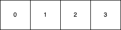
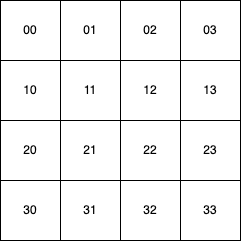
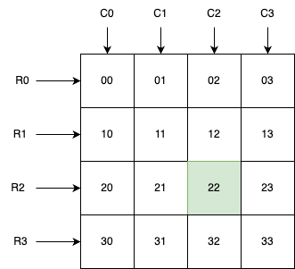
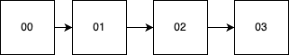
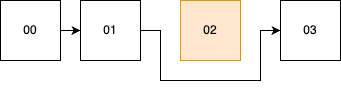

background-image: url(../img/title.svg)

---

background-image: url(../img/rec.svg)

---
background-image: url(../img/topic.svg)

.topic[Алгоритмы и структуры данных]
.tutor[Родион Ступников]
.tutor_desc[Software Engineer]

---

background-image: url(../img/rules.svg)

---

# Цели занятия

* понять что такое алгоритм и научиться его оценивать
* разобраться в базовых структурах данных и научиться их применять

---

# Что такое алгоритм

Алгоритм - это набор инструкций (шагов), который решает определенную задачу.

Любой код описывает по сути алгоритм.

---

# Как оценить алгоритм

Для оценки эффективности алгоритма и его потребления памяти мы используем O-нотацию.

Пример: `O(N)`

Где `N` - количество элементов в множестве

---
# Слайсы/Массивы

Как выглядит массив

.center-image[

]

---

# Слайсы/Массивы

* Чтение произвольного элемента из массива: `O(1)`. Память: `O(1)`
* Обновление произвольного элемента в массиве: `O(1)`. Память: `O(1)`
```go
slice[i] = 10
```
* Поиск определенного элемента в массиве: `O(N)`. Память: `O(1)`
```go
for _, val := range slice {
	    if val == targetVal {
		    return val
	    }
}
```
* Обратите внимание, что мы оцениваем всегда худший сценарий в O-нотации

---
# Слайсы/Массивы

* Как думаете как может выглядеть операция удаления элемента из массива?
* Какая ее сложность в `O` нотации?
* Сколько дополнительного места потребуется?

---

# Какие типы алгоритмов бывают

* `O(1)` - константное время выполнение (операции в массивах, хеш-мапах)
* `O(log N)` - логарифмическое время выполнения (Поиск по дереву)
* `O(N)` - линейное время выполнения (Сложение элементов в массиве)

---
# Какие типы алгоритмов бывают

* `O(N*log N)` - алгоритм сортировки QuickSort, MergeSort
* `O(N^2)` - квадратичная сложность: сортировка пузырьком, многие алгоритмы основанные на брутфорсе
* `O(2^N)` - эспоненциальная сложность: разные комбинаторные алгоритмы, генерация сочетаний или рекурсивное вычисление чисел Фибоначчи

---
# Стек 

Структура данных типа: LIFO - Last In, First Out. 

То есть элемент, который пришел в нее последний, будет забран первым
.center-image[

]

---
# Стек

```go

type Stack struct {
    items []interface{}
}
// Push добавляет элемент в вершину стека.
func (s *Stack) Push(item interface{}) {
    s.items = append(s.items, item) 
}

// Pop удаляет и возвращает элемент с вершины стека.
func (s *Stack) Pop() interface{} {
    if len(s.items) == 0 {
        return nil
    }

    index := len(s.items) - 1
    item := s.items[index]
    s.items = s.items[:index] // Удаляем элемент из среза
    return item
}


```
https://go.dev/play/p/1Oubr7jUibE

---
# Стек

* Какая сложность у операций Push и Pop?
* Что с затратами доп-памяти?
---
# Стек

Итого:
* O(1) на добавление элемента
* O(1) на изъятия элемента с вершины

---

# Матрицы

Матрица - это объект, записываемый в виде прямоугольной таблицы элементов, которая представляет собой совокупность строк и столбцов, 
на пересечении которых находятся её элементы.

.center-image[

]
---
# Матрицы

R - строки, С - столбцы

N = R*C

N - колличество элементов в матрице

.center-image[

]


---
# Матрицы

Где используются:
* Матрицы применяются для изображения картинок
* Очень важную роль играют в машинном обучении и компьютерном зрении
* Могут применяться как модели карты местности

---

# Матрицы

Вот так в коде могут быть представлены матрицы,
которые могли бы быть вам знакомы по линейной алгебре.

```go
// Matrix представляет матрицу.
type Matrix struct {
	data [][]int
}

// Set устанавливает значение элемента матрицы по заданным индексам.
func (m *Matrix) Set(row, col, value int) {
	m.data[row][col] = value
}

// Get возвращает значение элемента матрицы по заданным индексам.
func (m *Matrix) Get(row, col int) int {
	return m.data[row][col]
}

```

---
# Матрицы

Складывать матрицы можно только одинакового размера!

Операция сложения матриц:
```
Matrix A:
1, 2
3, 4

Matrix B:
2, 2
1, 1

Result A+B:
3, 4
4, 5

```

* Как думаете, какая сложность у алгоритма?
* И какие затраты по доп-памяти?

---
# Матрицы

Теперь посмотрим как это можно реализовать
```go
// Add выполняет операцию сложения двух матриц и возвращает новую матрицу-результат.
func (m *Matrix) Add(other *Matrix) (*Matrix, error) {
	rows := len(m.data)
	cols := len(m.data[0])

	if rows != len(other.data) || cols != len(other.data[0]) {
		return nil, fmt.Errorf("несовпадение размеров матриц")
	}

	resultData := make([][]int, rows)
	for i := range resultData {
		resultData[i] = make([]int, cols)
	}

	result := NewMatrix(resultData)
	for i := 0; i < rows; i++ {
		for j := 0; j < cols; j++ {
			result.Set(i, j, m.Get(i, j)+other.Get(i, j))
		}
	}

	return result, nil
}
```

---
# Матрицы

Полная версия кода здесь:

https://go.dev/play/p/bSf1Kkz0hPB

---
# Матрицы

Опциональное задание: написать операцию транспонирования, которое переворачивает матрицу на бок.
То есть делает строки столбцами.

-

Как думаете, какая сложность будет у алгоритма? А что с затратами памяти?


---
# Матрицы
Итого:
* O(1) на чтение и запись ячейки
* Количество всех элементов матрицы: N = R * C
* O(N) на сложение матриц
* O(N) на транспонирование матрицы

---
# Связный список

Связный список, это структура данных, где почти каждый элемент ссылается на своего соседа.


.center-image[

]

---
# Связный список

```go
// Node представляет элемент списка.
type Node struct {
	data int   // Данные элемента списка (в данном случае, целое число)
	next *Node // Ссылка на следующий элемент списка
}
```

---
# Связный список

```go
type Node struct {
	data int   // Данные элемента списка (в данном случае, целое число)
	next *Node // Ссылка на следующий элемент списка
}

type LinkedList struct {
	head *Node // Головной элемент списка (первый элемент)
}

// Append добавляет новый элемент в конец списка.
func (l *LinkedList) Append(data int) {
	newNode := &Node{data, nil}

	// Если список пуст, устанавливаем новый элемент как головной
	if l.head == nil {
		l.head = newNode
		return
	}

	// Находим последний элемент списка и добавляем новый элемент после него
	current := l.head
	for current.next != nil {
		current = current.next
	}
	current.next = newNode
}
```

---
# Связный список

* Какая у Append алгоритмическая сложность?.
* А можно ли ее как то улучшить?

---
# Связный список

Улучшенный Append
```go
type Node struct {
    data int   // Данные элемента списка (в данном случае, целое число)
    next *Node // Ссылка на следующий элемент списка
}

type LinkedList struct {
    head *Node // Головной элемент списка (первый элемент)
    tail *Node // Последний элемент списка (для быстрого добавления в конец)
}

func (l *LinkedList) Append(data int) {
    newNode := &Node{data, nil}
	
    if l.head == nil {
        l.head = newNode
        l.tail = newNode
        return
    }

    // Добавляем новый элемент после текущего последнего элемента и обновляем указатель на последний элемент
    l.tail.next = newNode
    l.tail = newNode
}
```

---
# Связный список

```go
// Traverse выполняет проход по списку и передает каждый элемент в функцию f.
func (l *LinkedList) Traverse(f func(int)) {
	current := l.head
	for current != nil {
		f(current.data)
		current = current.next
	}
}
```

Какая алгоритмическая сложность?

---
# Связный список: удаление элемента

Как можно реализовать удаление произвольного элемента из связного списка?

---
# Связный список: удаление элемента

Ниже показан принцип, как можно удалить произвольный аргумент из списка

-

.center-image[

]

-

Какая сложность у этой операции?

---
# Связный список: удаление элемента

```go
// FindAndRemove ищет заданный элемент в списке и удаляет его, если найден.
func (l *LinkedList) FindAndRemove(target int) {
    if l.head == nil {
        return
    }

    if l.head.data == target {
        l.head = l.head.next
        return
    }

    current := l.head
    for current.next != nil {
        if current.next.data == target {
            current.next = current.next.next
            return
		}
        current = current.next
	}
}
```

---
# Связный список как очередь

Давайте попробуем превратить связный список в очередь FIFO (First In, First Out)

Как могла бы работать операция Pop?

---
# Связный список как очередь

```go

// Pop удаляет первый элемент списка и возвращает его значение.
func (l *LinkedList) Pop() (int, error) {
	if l.head == nil {
		return 0, fmt.Errorf("список пуст, невозможно выполнить операцию Pop")
	}

	data := l.head.data
	l.head = l.head.next
	return data, nil
}
```

Какая алгоритмическая сложность?

---
# Связный список

* А на какую структуру данных связный список будет похож, если мы реализуем процедуру PopBack,
которая будет извлекать элемент с конца?
* Какая у нее будет сложность? 

---

# Связный список

Полная версия кода здесь:

https://go.dev/play/p/xLB70kycqoh

---

# Связный список
Итого:
* O(1) на добавление элемента
* O(1) на удаление элемента
* O(N) на перебор
* Произвольный доступ к любому элементу невозможен

---

# Опциональное задание

* Попробуйте написать очередь FIFO используя слайсы. 
* Какие у нее будут плюсы и минусы перед очередью, написанной на основе связанного списка?
* Можно ли ее улучшить, если мы введем ограничение на максимальное колличество элементов в ней?

---
# Итоги

* Мы разобрались с базовым понятием алгоритмической сложности.
* Узнали, как выглядит константная сложность `O(1)` и линейнац `O(N)`.
* Мы изучили такие структуры данных как: 
    * слайсы
    * стеки 
    * матрицы 
    * связанные списки и очереди
* Мы научились оценивать эффективность их работы через O-нотацию.

---

background-image: url(../img/questions.svg)

---

background-image: url(../img/poll.svg)

---

background-image: url(../img/next_webinar.svg)
.announce_date[13 Октября]
.announce_topic[Алгоритмы и структуры данных. Часть 2]

---
background-image: url(../img/thanks.svg)

.tutor[Родион Ступников]
.tutor_desc[Software Engineer]
