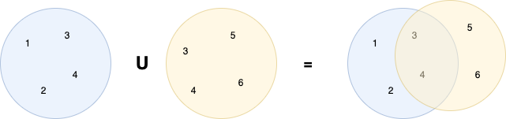

background-image: url(../img/title.svg)

---

background-image: url(../img/rec.svg)

---
background-image: url(../img/topic.svg)

.topic[Алгоритмы и структуры данных. Часть 2]
.tutor[Родион Ступников]
.tutor_desc[Software Engineer]

---

background-image: url(../img/rules.svg)

---
# Цели занятия

* изучить структуры данных такие как: множество, дерево (в т.ч. бинарное), граф, хеш таблица
* изучить эффективные алгоритмы поиска
* изучить случаи, когда приведенные выше структуры данных могут оказаться полезны

---
# Хеш таблица

В языке Go уже есть стандартная структура данных map, которая позволяет за константное 
время находить произвольный элемент по его ключу.

Map гарантирует, что все ключи внутри нее уникальны.


.center-image[

]

---
# Хеш таблица

Значением в хеш-таблице могут быть любые типы

А вот ключами: любые не ссылочные типы

```go
map[int][]int //ok
map[bool]string // ok
map[string]map[string]string //ok, может хранить внутри сложные объекты
map[[10]int64]float64 //ok
map[[]int]float64 // а вот так нельзя, []int - ссылочный тип
map[SomeStruct]*string //ok, если внутри нет ссылочных типов
map[interface{}]string //ok,  в интерфейс можно передать все, что не содержит ссылочные типы
map[[10]int64]interface{} //ok 
map[*int]bool - // так нельзя, *int - ссылочный тип
map[map[int]int]int // так нельзя, сама map - тоже ссылочный тип
map[interface{}]interface{} // ok
```

---
# Хеш таблица

Map - это ссылочный тип данных (как слайс). 
Их всегда нужно инициализировать перед использованием!

Ниже показаны способы создания map:

* С выделением емкости под будущие значения
```go
m := make(map[string]int, 10)
```

* С заданными значениями:
```go
m := map[string]int{
	"виталий": 31,
	"артем": 20,
	"петр": 25,
}
```

Еще один пример:
https://go.dev/tour/moretypes/20

---
# Хеш таблица

Чтение по ключу из хеш-таблицы: сложность O(1)

```go
val := m["артем"]
```
Если значение не существует в map, будет возвращено Zero Value.

Мы также можем вторым аргументом вычитать булевый флаг isExist.
```go
val, isExist := m["артем"]
```
В основном это нужно в сценариях, когда мы хотим узнать, 
действительно ли там записан ключ с ZeroValue,  или такого ключа там нет?

---
# Хеш таблица

Запись по ключу в хеш таблицу: сложность O(1)
```go
m["артем"] = 10
```

---
# Хеш таблица

С помощью оператора delete можно удалять значения из хеш-таблицы. 
```go
delete(m, "artem")
```
Как думаете, какая сложность у операции в O-нотации?

Пример внесения изменений в map:
https://go.dev/tour/moretypes/22

---
# Хеш таблица

Перебор всех ключей и значений в map

```go
for key, value := range m {
	fmt.Println(key, value)
}
```
Обратите внимание, что ключи и значения будут перебраны в случайном порядке.

https://go.dev/play/p/_8Yj1LON1ne

---
# Хеш таблица

Как она работает внутри:

.center-image[

]

---
# Хеш таблица

Больше можно узнать тут:
https://habr.com/ru/articles/457728/

---
# Множество

Множество - это как правило набор уникальных значений. 
В Go множество как правило реализуется через хеш-таблицу.

.

.center-image[

]

---

# Множество

Реализация

```go
type Set struct {
	data map[int]struct{}
}

// Создать новое множество
func NewSet() *Set {
	s := &Set{
		data: make(map[int]struct{}),
	}
	return s
}

// Добавить элемент в множество
func (s *Set) Append(item int) {
    s.data[item] = struct{}{}
}

```

---
# Множество

Множествами удобно моделировать объекты из реального мира.

Допустим, у нас есть студенты, которые могут относиться как к множеству, записаны на курс Go,
так и к множеству, которые записаны на курс по Алгоритмам.

---

# Множество

Операция объединения:

.center-image[

]

Что будет со сложностью?
Сколько нужно памяти?

---

# Множество

Операция объединения:

```go
func (s *Set) Add(other *Set) *Set {
    result := NewSet()

    // Добавляем элементы из текущего множества
    for item := range s.data {
        result.Append(item)
    }

    // Добавляем элементы из другого множества
    for item := range other.data {
        result.Append(item)
    }

    return result
}
```

Что будет со сложностью?
Сколько нужно памяти?

---
# Множество

Операция пересечения:

.center-image[

]

Что будет со сложностью?
Сколько нужно памяти?


---
# Множество

Операция пересечения:

```go
// Пересечение множеств
func (s *Set) Intersect(other *Set) *Set {
	result := NewSet()
	for item := range s.data {
		if other.Contains(item) {
			result.Append(item)
		}
	}
	return result
}

// Проверить, содержит ли множество элемент
func (s *Set) Contains(item int) bool {
    _, found := s.data[item]
    return found
}
```
Что будет со сложностью?
Сколько нужно памяти? 
Как можно оптимизировать?

---
# Множество

Потребление памяти при операции пересечения: O(min(n, m)) ~= O(N)

---
# Множество
Улучшенная операция пересечения

```go
func (s *Set) Intersect(other *Set) *Set {
	result := NewSet()
	var smaller, larger *Set

	// Определяем множество меньшего размера
	if len(s.data) < len(other.data) {
		smaller = s
		larger = other
	} else {
		smaller = other
		larger = s
	}

	for item := range smaller.data {
		if larger.Contains(item) {
			result.Append(item)
		}
	}
	return result
}
```

Теперь сложность: O(min(N,M)) ~= O(N)

Потребление памяти не изменилось: O(min(N,M))

---
# Множество

Операция вычитания:

.center-image[

]

---
# Множество

Операция вычитания:

```go

func (s *Set) Sub(other *Set) *Set {
    result := NewSet()
    for item := range s.data {
        if !other.Contains(item) {
            result.Add(item)
		}
    }
    return result
}
```

Что будет со сложностью?
А сколько доп-памяти потребуется?

---
# Множество

Полная версия кода:

https://go.dev/play/p/ihOzLkvHUbD

---
# Множество

Итоги:
* Операция добавления - O(1)
* Операция объединения - O(N+M) ~= O(N)
* Операция пересечения - O(min(N,M)), Память: O(min(N,M))
* Операция вычитания - O(M), Память: O(N-M)

---
# Бинарное Дерево

Бинарное дерево - это
иерархическая структура данных, в которой каждый узел
имеет не более двух потомков(детей).
Как правило, первый называется родительским узлом,
а дети называются левым и правым наследниками.
Дерево является частным случаем графа.

.center-image[

]

---
# Бинарное Дерево

Описание структуры:

```go
type TreeNode struct {
	Value int
	Left  *TreeNode
	Right *TreeNode
}

type BinaryTree struct {
	Root *TreeNode
}
```

---
# Бинарное Дерево

Операция поиска:
```go
// Метод для поиска значения в бинарном дереве
func (bt *BinaryTree) Search(value int) bool {
	currentNode := bt.Root
	for currentNode != nil {
		if value == currentNode.Value {
			return true
		} else if value < currentNode.Value {
			currentNode = currentNode.Left
		} else {
			currentNode = currentNode.Right
		}
	}
	return false
}
```

---
# Бинарное Дерево

Операция вставки:
```go
func (bt *BinaryTree) Insert(value int) {
    newNode := &TreeNode{Value: value}
    if bt.Root == nil {
        bt.Root = newNode
        return
    }
    currentNode := bt.Root
    for {
        if value < currentNode.Value {
            if currentNode.Left == nil {
                currentNode.Left = newNode
                return
            }
            currentNode = currentNode.Left
        } else {
            if currentNode.Right == nil {
                currentNode.Right = newNode
                return
            }
            currentNode = currentNode.Right
        }
    }
}
```

---
# Бинарное Дерево

Получение отсортированного по возрастанию массива:

```go
// Метод для обхода дерева в порядке "in-order"
func (bt *BinaryTree) ToSortedSlice() []int {
	stack := []*TreeNode{}
	currentNode := bt.Root
	var restult []int

	for currentNode != nil || len(stack) > 0 {
		for currentNode != nil {
			stack = append(stack, currentNode)
			currentNode = currentNode.Left
		}
		currentNode = stack[len(stack)-1]
		stack = stack[:len(stack)-1]
		restult = append(restult, currentNode.Value)
		currentNode = currentNode.Right
	}
	return restult
}
```

---
# Бинарное Дерево

Полная версия кода:
https://go.dev/play/p/yG2f0O0CY0F

---
# Несбалансированное бинарное дерево

Проблема несбалансированного дерева:

.center-image[

]

---
# Несбалансированное бинарное дерево

Поиск в таком дереве по эффективности не будет отличаться от поиска в связном списке.

То есть по сложности он составит O(N).
---
# Несбалансированное бинарное дерево

Есть специальные виды деревьев, которые умеют поддерживать сбалансированные состояния:
* Красно-черное дерево: https://ru.wikipedia.org/wiki/%D0%9A%D1%80%D0%B0%D1%81%D0%BD%D0%BE-%D1%87%D1%91%D1%80%D0%BD%D0%BE%D0%B5_%D0%B4%D0%B5%D1%80%D0%B5%D0%B2%D0%BE
* AVL-дерево: https://ru.wikipedia.org/wiki/%D0%90%D0%92%D0%9B-%D0%B4%D0%B5%D1%80%D0%B5%D0%B2%D0%BE

---
# Дерево
Итого:
* Вставка элемента при сбалансированности: O(log N) 
* Поиск элемента при сбалансированности: O(log N)
* Получение отсортированного массива: O(N)
* Так же присутствует возможность искать по диапазонам значений за O(log N) при сбалансированности

---
# Бинарный поиск

Этот алгоритм позволяет найти элемент в отсортированном массиве за O(log N). 
Будет в домашнем задании.
.center-image[

]

---

# Бинарный поиск

.center-image[

]

---

# Граф

---

background-image: url(../img/questions.svg)

---

background-image: url(../img/poll.svg)

---

background-image: url(../img/next_webinar.svg)
.announce_date[1 января]
.announce_topic[Тема следующего вебинара]

---
background-image: url(../img/thanks.svg)

.tutor[Лектор]
.tutor_desc[Должность]
