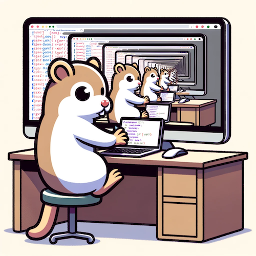
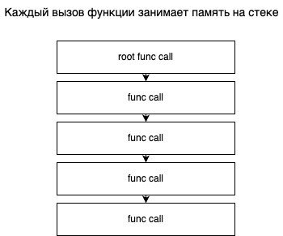
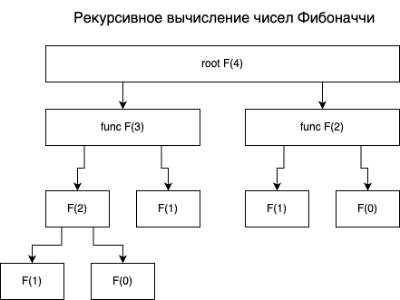
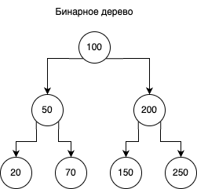
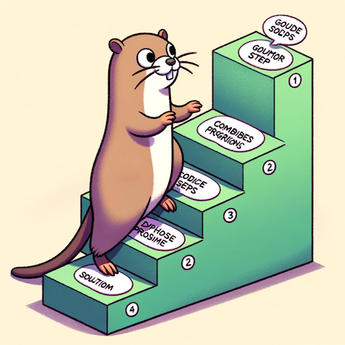
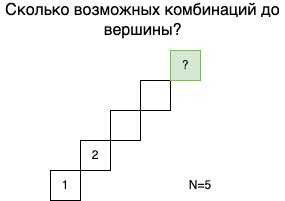

background-image: url(../img/title.svg)

---

background-image: url(../img/rec.svg)

---
background-image: url(../img/topic.svg)

.topic[Рекурсия и динамическое программирование]
.tutor[Родион Ступников]
.tutor_desc[Software Engineer]

---

background-image: url(../img/rules.svg)

---
# Цели занятия

* Понять принцип работы рекурсии
* Разобраться в плюсах и минусах рекурсивных алгоритмов
* Разобраться в плюсах и минусах динамического программирования

---

# Рекурсия

.center-image[

]

---

# Рекурсия

* В программировании рекурсия — вызов функции (процедуры) из неё же самой, 
непосредственно (простая рекурсия) или через другие функции (сложная или косвенная рекурсия).
* Например, функция A вызывает функцию B, а функция B — функцию A.
* Рекурсивная программа позволяет описать повторяющееся или даже потенциально бесконечное вычисление,
причём без явных повторений частей программы и использования циклов.

---

# Рекурсия

Потребление памяти при использовании рекурсии

.center-image[

]

---

# Рекурсия: числа Фибоначчи

```go
// Функция для вычисления числа Фибоначчи с использованием рекурсии
func fibonacci(n int) int {
	if n <= 1 { // терминальное условие
		return n
	}
	return fibonacci(n-1) + fibonacci(n-2)
}
```

```go
result := fibonacci(6)
```

Что со сложностью в O-нотации?

---
# Рекурсия: числа Фибоначчи

Полная версия кода:
https://go.dev/play/p/0L3_5nfKa0c

---

# Рекурсия: числа Фибоначчи

На изображении показано дерево рекурсивных вызовов для вычисления числа Фибоначчи F(4).

.center-image[

]

---

# Рекурсия: числа Фибоначчи

* N - номер числа Фибоначчи
* Сложность рекурсивного вычисления: O(2^N)
* Это происходит из-за того, что функция вызывает себя дважды для каждого числа Фибоначчи
и создает рекурсивное дерево с экспоненциальной глубиной.
* А вот память: O(N)

---
# Рекурсия: бинарное дерево

.center-image[

]

---
# Рекурсия: бинарное дерево

Старая версия кода без рекурсии: https://go.dev/play/p/yG2f0O0CY0F

Новая с рекурсией: https://go.dev/play/p/FsyxyrL-abM

Как думаете, изменилась ли сложность алгоритмов поиска и вставки от переписывания на рекурсию?

---

# Рекурсия

* Часто позволяет сделать код короче и выразительнее.
* Требует дополнительных расходов памяти под каждый рекурсивный вызов функции.

---

# Хвостовая рекурсия

Обычный код без оптимизации
```go
func factorial(n int) int {
    if n <= 1 {
        return 1
    }
    return n * factorial(n-1)
}
```

```go
// 5! = 5 * 4 * 3 * 2 * 1
result := factorial(5)
```

https://go.dev/play/p/S5bvbTquiY6

---
# Хвостовая рекурсия

Оптимизированный код

```go

func factorialTailRec(n, accumulator int) int {
	if n <= 1 {
		return accumulator
	}
	return factorialTailRec(n-1, n*accumulator)
}

func factorial(n int) int {
	return factorialTailRec(n, 1)
}
```
https://go.dev/play/p/ws0kBttPZnE

---
# Хвостовая рекурсия

Под капотом компилятор преобразует ее примерное в такую функцию:

```go
func factorial(n, accumulator int) int {
    for {
        if n <= 1 {
            return accumulator
        }
        accumulator *= n
        n--
    }
}

```
https://go.dev/play/p/WWOAYKsUCIf

---

# Динамическое программирование

.center-image[

]

---
# Динамическое программирование

Динамическое программирование - это способ решения сложных задач путём разбиения их на более простые подзадачи.
Один из подходов в динамическом программировании - использование в текущей итерации результатов,
полученных в предыдущих итерациях.


---
# Динамическое программирование: Фибоначчи

А теперь давайте попробуем посчитать числа Фибоначчи с помощью динамического программирования.

```go
func fibonacciDP(n int) int {
	if n <= 1 {
		return n
	}

	// Создаем массив для хранения результатов
	fib := make([]int, n+1)
	fib[0], fib[1] = 0, 1

	// Вычисляем числа Фибоначчи от 2 до n
	for i := 2; i <= n; i++ {
		fib[i] = fib[i-1] + fib[i-2]
	}

	return fib[n]
}
```
Что со сложностью и с памятью?


---
# Динамическое программирование: Фибоначчи

Полная версия кода:
https://go.dev/play/p/ka79Y5H4kdk


---
# Динамическое программирование: Лестница

Вы поднимаетесь по лестнице. Чтобы достичь вершины, нужно n шагов.

Каждый раз вы можете подняться на 1 или 2 ступеньки. Сколькими различными способами вы можете подняться на вершину?

.center-image[

]

---
# Динамическое программирование: Лестница

Пример 1:
```
Вход: n = 2
Выход: 2
Пояснение: Есть два способа подняться на вершину.
1. 1 шаг + 1 шаг
2. 2 шага
```
   
Пример 2:
```
Вход: n = 3
Выход: 3
Пояснение: Есть три способа подняться на вершину.
1. 1 шаг + 1 шаг + 1 шаг
2. 1 шаг + 2 шага
3. 2 шага + 1 шаг
```

---
# Динамическое программирование: Лестница

Решение задачи:

```go
func climbStairs(n int) int {
	if n < 3 {
		return n
	}
	steps := make([]int, n+1)
	steps[1] = 1
	steps[2] = 2
	for i := 3; i < len(steps); i++ {
		steps[i] = steps[i-1] + steps[i-2]
	}
	return steps[n]
}
```
Что с памятью и сложностью?

---
# Динамическое программирование: Лестница

Полная версия кода:
https://go.dev/play/p/2_5_oxzaReC

Можно ли улучшить память?

---
# Динамическое программирование: Лестница

Улучшить потребление памяти можно:

```go
func climbStairs(n int) int {
    if n < 3 {
        return n
    }

    prePrev := 1
    prev := 2

    for i := 3; i <= n; i++ {
        curr := prePrev + prev
        prePrev = prev
        prev = curr
    }

    return prev
}
```
https://go.dev/play/p/B_n79TFb9ke

---
# Динамическое программирование: max profit

```go
func maxProfit(prices []int) int {
	if len(prices) < 2 {
		return 0
	}

	profits := make([]int, len(prices))

	maxProf := 0
	for i := 1; i < len(prices); i++ {
		potentialProfit := prices[i] - prices[i-1]
		profits[i] = profits[i-1] + potentialProfit
		if profits[i] < 0 {
			profits[i] = 0
		}
		if profits[i] > maxProf {
			maxProf = profits[i]
		}
	}
	return maxProf
}
```
Что со сложностью и доп памятью?

---
# Итоги

---

background-image: url(../img/questions.svg)

---

background-image: url(../img/poll.svg)

---

background-image: url(../img/next_webinar.svg)
.announce_date[1 января]
.announce_topic[Тема следующего вебинара]

---
background-image: url(../img/thanks.svg)

.tutor[Лектор]
.tutor_desc[Должность]
