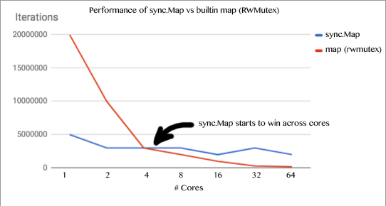

background-image: url(../img/title.svg)

---

background-image: url(../img/rec.svg)

---
background-image: url(../img/topic.svg)

.topic[Примитивы синхронизации]
.tutor[Кристина Ступникова]
.tutor_desc[Software Engineer at Tabby]

---

background-image: url(../img/rules.svg)

---

# О чем будем говорить

- ### WaitGroup
- ### Mutex
- ### sync.RWMutex
- ### sync.Map
- ### atomic
- ### Race-детектор

---

# sync.WaitGroup: какую проблему решает?

Что выведет эта программа?

```
func main() {
	for i := 0; i < 5; i++ {
		go func() {
			fmt.Println("go-go-go")
		}()
	}
}
```

https://goplay.tools/snippet/KY1h-xjHYuO

https://go.dev/play/p/KY1h-xjHYuO

---

# sync.WaitGroup: какую проблему решает?

```
func main() {
	const goCount = 5

	ch := make(chan struct{})
	for i := 0; i < goCount; i++ {
		go func() {
			fmt.Println("go-go-go")
			ch <- struct{}{}
		}()
	}

	for i := 0; i < goCount; i++ {
		<-ch
	}
}
```

https://goplay.tools/snippet/O0C7h_IsWl8

https://go.dev/play/p/O0C7h_IsWl8

---

# sync.WaitGroup: ожидание горутин

```
func main() {
	const goCount = 5

	wg := sync.WaitGroup{}
	wg.Add(goCount) // <===

	for i := 0; i < goCount; i++ {
		go func() {
			fmt.Println("go-go-go")
			wg.Done() // <===
		}()
	}

	wg.Wait() // <===
}
```

https://goplay.tools/snippet/u90fGD8vZ_X

https://go.dev/play/p/u90fGD8vZ_X

---

# sync.WaitGroup: ожидание горутин

```
func main() {
	wg := sync.WaitGroup{}

	for i := 0; i < 5; i++ {
		wg.Add(1) // <===
		go func() {
			defer wg.Done() // <===
			fmt.Println("go-go-go")
		}()
	}

	wg.Wait()
}
```

---

# sync.WaitGroup: API

```
type WaitGroup struct {
}

func (wg *WaitGroup) Add(delta int) - увеличивает счетчик WaitGroup.

func (wg *WaitGroup) Done() - уменьшает счетчик на 1.

func (wg *WaitGroup) Wait() - блокируется, пока счетчик WaitGroup не обнулится.
```

---

# sync.WaitGroup: практика

```
type task struct {
	name  string
	sleep time.Duration
}
```

```
func doJob(t task) {
	fmt.Printf("task %q begin\n", t.name)
	time.Sleep(t.sleep)
	fmt.Printf("task %q end\n", t.name)
}
```

```
	// Сделать так, чтобы задачи выполнялись конкурентно.
	// Дождаться выполнения всех задач.
	for _, t := range tasks {
		doJob(t)
	}
```

https://goplay.tools/snippet/BnGpsftx3zo

https://go.dev/play/p/BnGpsftx3zo

---

# sync.Mutex: какую проблему решает?

```
func main() {
	wg := sync.WaitGroup{}

	v := 0
	for i := 0; i < 1000; i++ {
		wg.Add(1)
		go func() {
			v++
			wg.Done()
		}()
	}

	wg.Wait()
	fmt.Println(v)
}
```

https://goplay.tools/snippet/bf6NKB5z0QO

https://go.dev/play/p/bf6NKB5z0QO

---

# sync.Mutex

```
$ GOMAXPROCS=1 go run mu.go
1000
$ GOMAXPROCS=4 go run mu.go
947
$ GOMAXPROCS=4 go run mu.go
956
```

---

# sync.Mutex

```
func main() {
	wg := sync.WaitGroup{}

	v := 0
	for i := 0; i < 1000; i++ {
		wg.Add(1)
		go func() {
			old_v := v
			new_v := old_v + 1
			v = new_v
			wg.Done()
		}()
	}

	wg.Wait()
	fmt.Println(v)
}
```

---

# sync.Mutex

Мью́текс (англ. mutex, от mutual exclusion — «взаимное исключение»).

<br>

Код между Lock и Unlock выполняет только одна горутина, остальные ждут:

```
mutex.Lock()
v++
mutex.Unlock()
```

---

# sync.Mutex

```
func main() {
	wg := sync.WaitGroup{}
	mu := sync.Mutex{}

	v := 0
	for i := 0; i < 1000; i++ {
		wg.Add(1)
		go func() {
			mu.Lock()   // <===
			v++
			mu.Unlock() // <===
			wg.Done()
		}()
	}

	wg.Wait()
	fmt.Println(v)
}
```

---

# sync.Mutex: паттерны использования

### Помещайте мьютекс выше тех полей, доступ к которым он будет защищать

```
var sum struct {
    mu sync.Mutex // <=== этот мьютекс защищает
    i  int        // <=== поле под ним
}
```

---

# sync.Mutex: паттерны использования

### Используйте defer, если есть несколько точек выхода

```
func doSomething() {
	mu.Lock()
	defer mu.Unlock()

    err := ...
	if err != nil {
		return // <===
	}

    err = ...
	if err != nil {
		return // <===
	}
	return // <===
}
```

---

# sync.Mutex: паттерны использования

### НО!

### Держите блокировку не дольше, чем требуется

```
func doSomething(){
    mu.Lock()
    item := cache["myKey"]
    mu.Unlock()

    http.Get() // дорогой IO-вызов
}
```

---

# sync.Mutex: дедлок

Что такое дедлок?

<br/>

https://goplay.tools/snippet/PLLvZfDiDqs

https://go.dev/play/p/PLLvZfDiDqs
---

# sync.Mutex

```
type Counters struct {
    mu sync.Mutex
    m  map[string]int
}

func (c *Counters) Load(key string) (int, bool) {
    c.mu.Lock()
    defer c.mu.Unlock()
    val, ok := c.m[key]
    return val, ok
}

func (c *Counters) Store(key string, value int) {
    c.mu.Lock()
    defer c.mu.Unlock()
    c.m[key] = value
}
```

https://goplay.tools/snippet/Qp-w_QsOleR

https://go.dev/play/p/Qp-w_QsOleR

---

# sync.RWMutex

```
type Counters struct {
    mu sync.RWMutex
    m  map[string]int
}

func (c *Counters) Load(key string) (int, bool) {
    c.mu.RLock()
    defer c.mu.RUnlock()
    val, ok := c.m[key]
    return val, ok
}

func (c *Counters) Store(key string, value int) {
    c.mu.Lock()
    defer c.mu.Unlock()
    c.m[key] = value
}
```

https://goplay.tools/snippet/1Itioa-0cXF

https://go.dev/play/p/1Itioa-0cXF

---

# Cache contention

.full-image[

]

При блокировке на чтение каждое ядро обновляет счетчик. Что приводит к инвалидации счетчика в кэше других ядер.

https://habr.com/ru/post/338718/

---

# sync.Map

### Решает проблему частых чтений для map + rwmutex.

.threefour-image.center-image[

]

https://medium.com/@deckarep/the-new-kid-in-town-gos-sync-map-de24a6bf7c2c

---

# sync.Map

```
type Map struct {
}

func (m *Map) Delete(key interface{})
func (m *Map) Load(key interface{}) (value interface{}, ok bool)
func (m *Map) LoadOrStore(key, value interface{}) (actual interface{}, loaded bool)
func (m *Map) Range(f func(key, value interface{}) bool)
func (m *Map) Store(key, value interface{})
```

https://www.youtube.com/watch?v=C1EtfDnsdDs

---

# sync.Map

```
type Counters struct {
	m sync.Map
}

func (c *Counters) Load(key string) (int, bool) {
	val, ok := c.m.Load(key)
	if !ok {
		return 0, false
	}
	return val.(int), true
}

func (c *Counters) Store(key string, value int) {
	c.m.Store(key, value)
}

func (c *Counters) Range(f func(k string, v int) bool) {
	c.m.Range(func(k, v interface{}) bool {
		return f(k.(string), v.(int))
	})
}
```

https://goplay.tools/snippet/SYciXadco3q

https://go.dev/play/p/SYciXadco3q

---

# atomic: Add

```
func main() {
	wg := sync.WaitGroup{}

	var v int64
	for i := 0; i < 1000; i++ {
		wg.Add(1)
		go func() {
			atomic.AddInt64(&v, 1) // атомарный v++
			wg.Done()
		}()
	}

	wg.Wait()
	fmt.Println(v)
}
```

https://goplay.tools/snippet/SHwBoHdsUsg

https://go.dev/play/p/SHwBoHdsUsg

---

# atomic: Store/Load

```
func main() {
	wg := sync.WaitGroup{}
	var luckyNumber int32 = 7

	wg.Add(2)

	go func() {
		atomic.StoreInt32(&luckyNumber, 42)
		wg.Done()
	}()

	go func() {
		fmt.Println(atomic.LoadInt32(&luckyNumber))
		wg.Done()
	}()

	wg.Wait()
}

```

https://goplay.tools/snippet/1CKmqzRzXfb

https://go.dev/play/p/1CKmqzRzXfb

---

# Race detector

В чем проблема, кроме неопределенного поведения?

```
func main() {
	wg := sync.WaitGroup{}
	text := ""

	wg.Add(2)

	go func() {
		text = "hello world"
		wg.Done()
	}()

	go func() {
		fmt.Println(text)
		wg.Done()
	}()

	wg.Wait()
}
```

---

# Race detector

```
$ go test -race mypkg
$ go run -race mysrc.go
$ go build -race mycmd
$ go install -race mypkg
```

https://blog.golang.org/race-detector

http://robertknight.github.io/talks/golang-race-detector.html

---

# Race detector

Ограничение race детектора:

```
func main() {
	for i := 0; i < 10000; i++ {
		go func() {
			time.Sleep(10*time.Second)
		}()
	}
	time.Sleep(time.Second)
}
```

Можно исключить тесты:

```
// +build !race

package foo

// The test contains a data race. See issue 123.
func TestFoo(t *testing.T) {
	// ...
}
```

---

# С чем мы сегодня познакомились?

- ### WaitGroup
- ### Mutex
- ### sync.RWMutex
- ### sync.Map
- ### atomic
- ### Race-детектор

---
background-image: url(../img/questions.svg)

---

background-image: url(../img/poll.svg)

---

background-image: url(../img/next_webinar.svg)
.announce_date[22 Ноября]
.announce_topic[Runtime языка]

---
background-image: url(../img/thanks.svg)

.tutor[Кристина Ступникова]
.tutor_desc[Software Engineer at Tabby]
