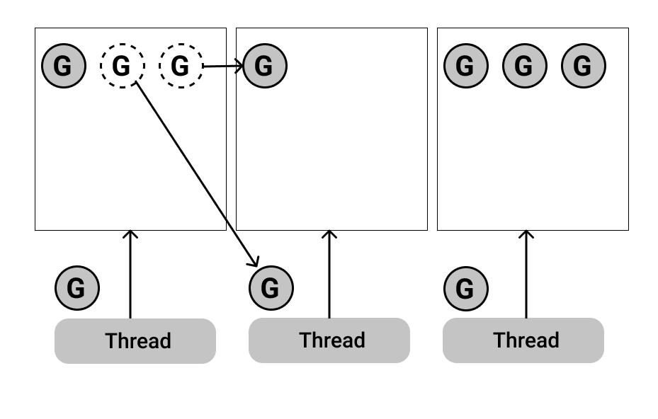
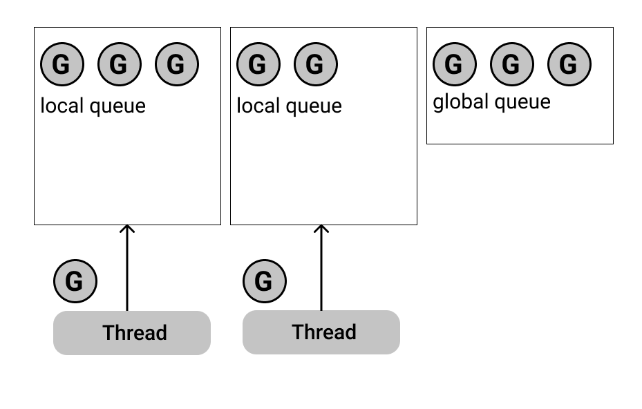
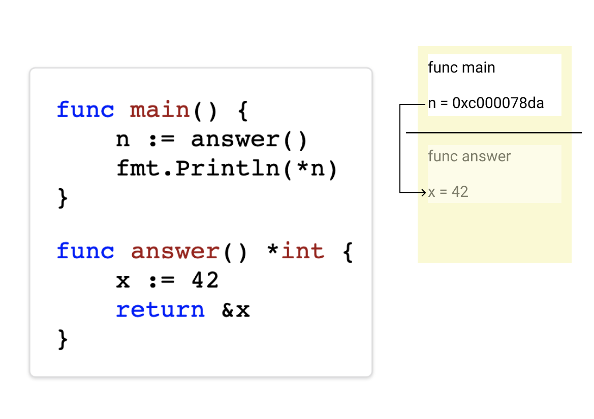

background-image: url(../img/title.svg)

---

background-image: url(../img/rec.svg)

---
background-image: url(../img/topic.svg)

.topic[Runtime языка]
.tutor[Кристина Ступникова]
.tutor_desc[Software Engineer at Tabby]

---

background-image: url(../img/rules.svg)

---

# Краткое содержание

* ### Что такое планировщик.
* ### Особенности работы планировщика Go.
* ### Почему планировщик Go такой, какой он есть.
* ### Зачем знать?
* ### Выделение памяти

---

# Взаимодействие с ОС

## Зачем Важно знать о взаимодействии с ОС?

---

# Взаимодействие с ОС

## Зачем Важно знать о взаимодействии с ОС?

- ### Знание особенностей ОС позволяет лучше предотвращать сбои и уязвимости
- ### Понимание взаимодействия с ОС позволяет лучше понимать, как работает язык и его библиотеки
- ### Понимание, как Golang взаимодействует с системой, помогает оптимизировать использование CPU и памяти

---

# Основы Взаимодействия с ОС в Golang

## Примеры взаимодействия с ОС в Golang

* Пакеты os, syscall (запись, чтение файлов, работа с каталогами etc...)
* Сетевые вызовы
* Выделение ресурсов (памяти, процессорного времени)

---

# Абстракция

## Одна из ключевых особенностей Golang - абстракция от деталей ОС

- ### Большая часть вашего кода может оставаться неизменной независимо от того, на какой ОС он запускается
- ### Golang скрывает сложности взаимодействия с разными ОС, предоставляя единый интерфейс

---

# Портируемость и Кроссплатформенность

## Golang обеспечивает высокую степень портируемости и кроссплатформенности

- ### Это делает язык идеальным выбором для создания приложений, которые должны работать на различных операционных системах, будь то Linux, Windows или macOS

---

# Введение в Планировщик Golang

.center-image.threefour-image[

]

---

# Зачем нужен планировщик?

---

# Зачем нужен планировщик?

### Распределять вычислительные ресурсы между задачами.

.center-image.threefour-image[

]
---

# Зачем Go собственный планировщик?

* ### Уже есть планировщик процессов и потоков в ядре.

* ### Почему бы не запускать каждую горутину в отдельном потоке?

---

# Зачем Go собственный планировщик?

## Проблемы потоков

* ### Потоки дорогие по памяти (из-за стэка).
* ### Потоки дорого переключать (сисколы, контекст).

<br>

## Решения в Go

* ### Go использует growable stack.
* ### Go выбирает моменты, когда переключение дешевое.

---

# Проектируем планировщик: m-n threading

.full-image[

]

---

# Проектируем планировщик: m-n threading

.full-image[

]

Какие есть проблемы?

---

# Проектируем планировщик: m-n threading

.full-image[

]

.

---

# Проектируем планировщик: отдельные очереди

.full-image[

]

Какие есть проблемы?

---

# Проектируем планировщик: закончилась очередь

.full-image[

]

---

# Проектируем планировщик: work stealing

.full-image[

]

http://supertech.csail.mit.edu/papers/steal.pdf

---

# Проектируем планировщик: syscall

.full-image[

]

Тред заблокирован.

---

# Проектируем планировщик: syscall

.full-image[

]

Создаем новый тред.

---

# Проектируем планировщик: syscall

.full-image[

]

Куда деть горутину после syscall'a?


---

# Проектируем планировщик: глобальная очередь

.full-image[

]

---

# Проектируем планировщик: все идеи вместе

.full-image[

]

---


# Планировщик: голодание горутины

* ### А что если одна горутина находится в бесконечном цикле?

---

# Планировщик: голодание горутины

Go 1.14 Asynchronous Preemption:
* https://medium.com/a-journey-with-go/go-asynchronous-preemption-b5194227371c
* https://github.com/golang/proposal/blob/master/design/24543-non-cooperative-preemption.md

---

# Планировщик: порядок поиска работы

* ### Локальная очередь
* ### Глобальная очередь
* ### Work stealing

---
# Планировщик: порядок поиска работы

.full-image[

]
---

# Работа с памятью

## Зачем нам знать про работу Go с памятью?

Ведь все автоматически выделятеся и удаляется.

---

# Зачем?

- ### Не нужно, чтобы писать хорошие программы на Go.
- ### .<br>.
- ### .

---

# Зачем?

- ### Не нужно, чтобы писать хорошие программы на Go.
- ### Нужно, когда есть проблемы с производительностью из-за памяти.<br>(и есть пруфы!)
- ### .

---

# Зачем?

- ### Не нужно, чтобы писать хорошие программы на Go.
- ### Нужно, когда есть проблемы с производительностью из-за памяти.<br>(и есть пруфы!)
- ### Важно знать поведение, а не то, как все устроено.

---

# Память процесса в Linux

.threefour-image[

]

---

# Stack vs Heap

.full-image[

]

---

# Go: Stack vs Heap

## Как узнать, где Go выделит память?
## .

---

# Go: Stack vs Heap

## Как узнать, где Go выделит память?
## Зачем это знать? :)

---

# Go: Stack

.full-image[

]

---

# Go: Stack

.full-image[

]

---

# Go: Stack

.full-image[

]

---

# Go: Stack

.full-image[

]

---

# Go: Stack

.full-image[

]

---

# Go: Stack pointer

.full-image[

]

---

# Go: Stack pointer

.full-image[

]

---

# Go: Stack pointer

.full-image[

]

---

# Go: Stack pointer

.full-image[

]

---

# Go: Stack pointer

.full-image[

]

---

# Go: Stack pointer

.full-image[

]

---

# Go: Heap

.full-image[

]

---

# Go: Heap

.full-image[

]

---

# Go: Heap

.full-image[

]

---

# Go: Heap

.full-image[

]

---

# Go: Heap

.full-image[

]

---

# Go: Heap

.full-image[

]

---

# Go: Heap

.full-image[

]

---

# Go: Heap

.full-image[

]

---

# Go: Heap

.full-image[

]

---

# Go: Stack vs Heap

## Как узнать, где Go выделит память?

---

# Go: Stack vs Heap

## Никак.

Только компилятор знает, где будет выделена память.

---

# Go: escape analysis

```
go build -gcflags="-m"
```

```
...

./full.go:12:2: moved to heap: x

...

./full.go:7:14: *n escapes to heap

...
```

---

# Go: Stack vs Heap

## Зачем знать, где Go выделит память?

---
# Что мы узнали?

* ### Что такое планировщик.
* ### Особенности работы планировщика Go.
* ### Почему планировщик Go такой, какой он есть.
* ### Зачем знать?
* ### Выделение памяти


---

background-image: url(../img/next_webinar.svg)
.announce_date[27.11]
.announce_topic[Работа с сетью. Часть 1]

---
background-image: url(../img/thanks.svg)

.tutor[Кристина Ступникова]
.tutor_desc[Software Engineer at Tabby]
