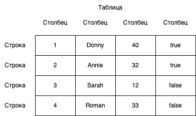
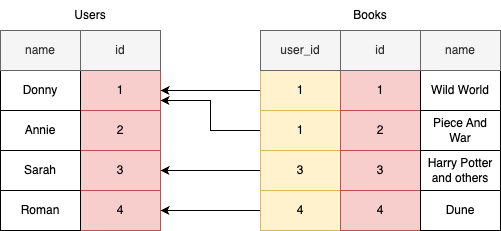

background-image: url(../img/title.svg)

---

background-image: url(../img/rec.svg)

---
background-image: url(../img/topic.svg)

.topic[Работа с базами данных]
.tutor[Родион Ступников]
.tutor_desc[Software Engineer]

---

background-image: url(../img/rules.svg)

---

# Введение в хранение данных

Как мы можем хранить данные приложения?

---
# Введение в хранение данных

Можно их хранить в простом файле!

Какие есть плюсы и минусы у этого решения?

<br>

.center-image[

]
---
# Хранение в файле

Плюсы:
* Простота
* Эффективная запись append
* Дешево с точки зрения ресурсов - минимальные расходы на RAM и CPU

---
# Хранение в файле

Минусы:
* Сложно организовать эффективный поиск
* Сложно организовать эффективное удаление/обновление данных
* Необходимо решать проблемы с data races
* Нет поддержки хранения целостности данных
* Нет поддержки транзакций
* Нет готовых механизмов репликации и шардирования
* При решении этих проблем мы потеряем простоту

---
# Базы данных

К счастью, эти проблемы давно были решены за нас разработчиками БД.
Базы данных принято делить на два типа:
* SQL (Реляционные)
* NoSQL

---
# Реляционные базы данных

.center-image.half-image[

]

---
# Реляционные базы данных


Особенности:

* Наличие статичной схемы данных
* Более сложное горизонтальное масштабирование
* Поддержка транзакций и целостности данных
* Поддержка ассоциаций (через вторичные ключи)
* Возможность строить сложные запросы к данным (SQL)

---
# Реляционные базы данных

Примеры:
* MySQL
* PostgreSQL
* Oracle
* Microsoft SQL Server

---
# NoSQL Базы данных

.center-image.half-image[

]

---

Особенности:

* Частичная поддержка SQL или отсутствие ее
* Гибкая схема данных или отсутствие жесткой структуры
* Простое горизонтальное масштабирование
* Различные модели данных, такие как ключ-значение, документоориентированные, столбцовые и графовые
* Обычно отсутствует поддержка транзакций и целостности данных
* Подходит для случаев, когда необходимо обрабатывать большие объемы данных с высокой нагрузкой

---
# NoSQL Базы данных

Примеры типов NoSQL БД:

* MongoDB (документоориентированные)
* Cassandra (столбцовые)
* Redis (ключ-значение)
* Neo4j (графовые)

---
# Основные понятия реляционных баз данных

Прежде чем начать работу с реляционными базами данных, важно понимать некоторые основные понятия:

* Таблицы (Tables): Таблица - это основная структура данных в реляционной базе данных. Она представляет собой двумерную структуру, состоящую из строк и столбцов, где каждая строка представляет запись, а каждый столбец - атрибут (поле) записи.
* Столбцы (Columns): Столбцы таблицы определяют атрибуты данных, хранящиеся в базе данных. Каждый столбец имеет имя и тип данных, который определяет, какого вида данные можно хранить в этом столбце (например, числа, строки, даты и т. д.).
* Строки (Rows): Строки представляют собой конкретные записи или данные, хранящиеся в таблице. Каждая строка содержит значения атрибутов, соответствующих этой записи.

---
# Основные понятия реляционных баз данных

.center-image[

]

---
# Основные понятия реляционных баз данных

Понятия:
* Первичный ключ (Primary Key): Это уникальный идентификатор каждой записи в таблице. Первичный ключ гарантирует уникальность записей в таблице и обеспечивает быстрый доступ к данным.
* Внешний ключ (Foreign Key): Внешний ключ используется для связи двух таблиц в базе данных. Он создает ссылку между записями в разных таблицах, обеспечивая целостность данных и возможность выполнения сложных запросов.

---
# Основные понятия реляционных баз данных

.center-image[

]

---
# PostgreSQL

.center-image.half-image[

]

---
# PostgreSQL

Далее в примерах мы будем использовать Postgres.
Эта БД имеет следующие особенности:

* Открытое исходное коды
  * PostgreSQL является открытой и бесплатной реляционной СУБД с открытым исходным кодом. Это означает, что вы можете свободно скачивать, использовать и изменять исходный код PostgreSQL в соответствии с вашими потребностями.
* Полная поддержка SQL
  * PostgreSQL обеспечивает полную совместимость с SQL, что делает его мощным инструментом для выполнения разнообразных операций над данными.
* Множество типов данных
  * Postgres предоставляет богатый набор встроенных типов данных, включая числа, строки, даты, массивы и геометрические типы, а также позволяет создавать пользовательские типы данных.

---
# PostgreSQL

Особенности:
* Расширяемость
  * Вы можете расширять функциональность PostgreSQL с помощью пользовательских функций, процедур и агрегатных функций, а также создавать свои собственные типы данных.
* Транзакции
  * PostgreSQL поддерживает транзакции, что обеспечивает согласованность данных и позволяет откатывать изменения в случае ошибок. PostgreSQL поддерживает транзакции, что обеспечивает согласованность данных и позволяет откатывать изменения в случае ошибок.
* Расширенные возможности индексации
  * Postgres предоставляет широкие возможности для создания индексов, включая B-tree, hash, GiST, GIN и другие, что позволяет оптимизировать запросы к данным.


---

# PostgreSQL

Особенности:
* JSON и JSONB
  * PostgreSQL поддерживает хранение и манипуляции данными в формате JSON и JSONB, что делает его подходящим для работы с полуструктурированными данными.
* Расширения
  * С помощью расширений (extensions), вы можете легко добавлять дополнительные функциональные возможности в PostgreSQL, такие как полнотекстовый поиск, географическае индексы и другие.
* Активное сообщество
  * PostgreSQL имеет активное сообщество разработчиков и пользователей, что обеспечивает поддержку, обновления и развитие СУБД.


---
# PostgreSQL
Можно устновить ее напрямую на host-машину, следуя инструкциям на официальном сайте:
https://www.postgresql.org/download/

---
# PostgreSQL
Установка через Docker с помощью docker-file

```yaml
version: '3.8'

services:
  postgres:
    image: postgres:15.4
    ports:
      - 5432:5432
    environment:
      POSTGRES_PASSWORD: ${POSTGRES_PASSWORD}
      POSTGRES_USER: ${POSTGRES_USER}
    volumes:
      # Указываем, куда можно примонтировать папку 
      # с данными на локальную хост машину.
      # Таким образом данные будет проще забекапить или перенести,
      # а так же они не удалятся если удалить контейнер.
      - /data/postgres:/var/lib/postgresql/data

```

---
# Клиент для Postgres

Удобный клиент с графическим интерфейсом: https://www.pgadmin.org/download/

---
# Создание базы данных

Для работы с реляционными базами данных, вы можете использовать SQL для создания базы данных и таблиц. 
Вот пример SQL-кода для создания базы данных

```sql
CREATE DATABASE mydatabase;
```
В системе RDBMS (Relation Database Management System) может существовать несколько баз данных.
База данных - это некое общее пространство (namespace) для таблиц, индексов, процедур, прав доступа и тд.
Как правило, каждый проект или подсистема можем иметь в ней свою независимую базу данных.

---
# Переключение между базами данных

```sql
USE mydatabase;
```

Данная команда указывает, какую БД мы будем использовать по умолчанию при запросах.

---
# Создание таблицы

```sql
CREATE TABLE users (
   id INT PRIMARY KEY,
   name VARCHAR(255),
   email VARCHAR(255),

   is_blocked BOOLEAN NOT NULL DEFAULT false,
   created_at TIMESTAMP NOT NULL default now()
);

```

Этот код создаст базу данных "mydatabase" и таблицу "users" с тремя столбцами: "id", "name" и "email".

---
# Индексы

.center-image.half-image[

]


---
# Индексы

Индексы позволяют ускорить выполнение запросов к базе данных, особенно при поиске данных. Вы можете создать индексы на одном или нескольких столбцах таблицы. Вот пример SQL-кода для создания индекса:

```sql
CREATE INDEX idx_name ON users (name);
```

Этот код создаст индекс по столбцу "name" в таблице "users", что ускорит поиск данных по этому столбцу.
создаст B-tree индекс на столбце name в таблице users. 
B-tree (Balanced Tree) - это один из наиболее распространенных типов индексов в реляционных базах данных, 
используемых для ускорения операций поиска и сортировки данных.
В данном примере по умолчанию создастся индекс BTree.

---
# Индексы


Так можно создать уникальный индекс:

```sql
CREATE UNIQUE INDEX idx_email ON users (email);
```

Уникальные индексы обеспечивают уникальность значений в столбце, что позволяет предотвратить наличие дубликатов.
В данном примере по умолчанию создастся индекс BTree.

---
# Индексы

Так же можно создавать индексы типа "Hash":

```sql
CREATE INDEX idx_hash ON users USING hash (name);
```

Используют хеш-функции для быстрого поиска значений.
Подходит для операций сравнения равенства (=) и вхождения (IN). 
Особенно эффективен для операций поиска в больших объемах данных.

---
# Индексы

Другие виды индексов:

* GiST (Generalized Search Tree)
  * Предназначен для поддержки поиска и сравнения сложных данных, таких как географические данные или полнотекстовый поиск.
* GIN (Generalized Inverted Index)
  * Используется для индексации массивов и полей с JSON-данными. Эффективен для запросов, содержащих условия вхождения элемента.

---
# Индексы

Другие виды индексов:

* SP-GiST (Space-Partitioned Generalized Search Tree)
  * Подходит для индексации данных, которые могут быть разбиты на непересекающиеся пространственные области, такие как геометрические данные.
* BRIN (Block Range INdexes)
  * Применяется к большим объемам данных, например, к временным рядам. Разделяет данные на блоки и создает индекс по минимальным и максимальным значениям блоков.
* Bitmap-индексы
  * Используют битовые маски для индексации данных. Подходит для низкокардинальных столбцов, где уникальных значений сравнительно немного.

---
# Foreign Keys

.center-image[

]

```sql
CREATE TABLE Users (
  id INT PRIMARY KEY, -- первичный ключ
  name VARCHAR(255)
);

CREATE TABLE Books (
  id INT PRIMARY KEY, -- первичный ключ
  user_id INT, -- внешний ключ, связывающий с таблицей Users
  name VARCHAR(255),
  -- ограничение внешнего ключа, связывающее user_id с id в таблице Users
  FOREIGN KEY (user_id) REFERENCES Users(id)
);
```

---

# SQL (DLQ)

DQL - Data Query Language.

Выборка без каких либо ограничений:
```sql
SELECT * FROM users;
```

Выборка конкретных полей:
```sql
SELECT id, name FROM users;
```

---
# SQL (DLQ)

Выбрать заблокированных пользователей:
```sql
SELECT * FROM users WHERE is_blocked = true;
```

Выбрать пять заблокированных пользователей:
```sql
SELECT * FROM users WHERE is_blocked = true LIMIT 5;
```

---
# SQL (DLQ)

```sql
SELECT * FROM customers
WHERE country = 'USA'
  AND (age >= 25 OR loyalty_points > 1000)
LIMIT 5;
```

Возвращает клиентов из США, 
старше 25 лет или с более чем 1000 бонусных баллов.

---
# SQL (DLQ)

```sql
SELECT * FROM users ORDER BY created_at DESC LIMIT 5
```

Возвращается 5 пользователей по убыванию DESC даты регистрации.
Использование ASC или значения по умолчанию вернет их по возрастанию, соответственно.

---
# Вставка (DML)

Добавление нового пользователя

```sql
INSERT INTO users (id, name, email) VALUES (1, 'John Doe', 'john@example.com');
```

---
# Вставка (DML)

```sql
CREATE TABLE users (
   id SERIAL PRIMARY KEY,
   name VARCHAR(255) NOT NULL,
   email VARCHAR(255)
);
```

Если `id` при вставке может сгенерить сама БД (к примеру имеет тип SERIAL), то при инсерте его можно опустить.

```sql
INSERT INTO users (name) VALUES ('John Doe');
```
В этом примере мы опустили и `email`, поскольку NULL для него - допустимый тип. 
А вот `name` мы опустить не можем из за модификатора `NOT NULL`.

---
# Обновление (DML)

Обновление данных пользователя:
```sql
UPDATE users SET email = 'newemail@example.com' WHERE id = 1;
```
Обратите внимание, что нужно обязательно нужно написать `WHERE`, иначе
email будет обновлен абсолютно для всех пользователей.

---
# Удаление (DML)

Удаление пользователя:

```sql
DELETE FROM users WHERE id = 1;
```

Тут аналогично, если не укажем `WHERE`, то мы удалим всех пользователей.

---
# Агрегация

Что такое агрегация?

Агрегация в SQL - это процесс вычисления сумм, средних значений, минимумов, максимумов 
и других сводных характеристик данных из одной или нескольких строк в таблице.

Агрегация очень полезна для получения статистических данных

---
# Агрегация

Для агрегации данных часто используется группировка `GROUP BY`, которая разделяет данные 
на группы на основе значения одного или нескольких столбцов.


---
# Агрегация
Популярные агрегатные функции:

* SUM(): Вычисляет сумму значений в столбце.
* AVG(): Вычисляет среднее значение в столбце.
* MIN(): Находит минимальное значение в столбце.
* MAX(): Находит максимальное значение в столбце.
* COUNT(): Подсчитывает количество строк или значений в столбце.

---

# Агрегация

С помощью такой агрегационной функции `count` можно узнать общее число пользователей в БД.
```sql
SELECT count(*) FROM users;
```

---

# Агрегация

А так мы можем узнать, 
сколько пользователей зарегистрировалось по определенным референсам:

```sql
SELECT count(*), reference FROM users GROUP BY reference;
```

---
# Агрегация

Получение средней ЗП по каждому департаменту:

```sql
SELECT department, AVG(salary) AS average_salary
FROM employees
GROUP BY department;

```

---
# Объединение таблиц

`INNER JOIN` возвращает только те строки, для которых есть совпадение в обеих таблицах. 
Это означает, что только строки с соответствующими значениями
в объединяющем столбце будут включены в результат.

Пример:
```sql
SELECT orders.order_id, customers.customer_name
FROM orders
INNER JOIN customers
ON orders.customer_id = customers.customer_id;
```
Результат будет содержать только заказы, для которых есть соответствующие клиенты.

---
# Объединение таблиц

`LEFT JOIN` возвращает все строки из левой таблицы (первой таблицы в запросе) 
и соответствующие строки из правой таблицы. 
Если нет соответствия в правой таблице, будут возвращены NULL значения.

Пример:
```sql
SELECT customers.customer_name, orders.order_id
FROM customers
LEFT JOIN orders
ON customers.customer_id = orders.customer_id;
```

Результат содержит все клиенты, даже если у них нет заказов.

---
# Объединение таблиц

`RIGHT JOIN` аналогичен LEFT JOIN, но возвращает все строки из правой таблицы и соответствующие строки из левой таблицы. 
Если нет соответствия в левой таблице, будут возвращены NULL значения.

Пример:

```sql

SELECT customers.customer_name, orders.order_id
FROM customers
RIGHT JOIN orders
ON customers.customer_id = orders.customer_id;
```

Результат содержит все заказы, даже если у них нет клиентов.

---
# Объединение таблиц и агрегация

```sql
CREATE TABLE students (
   id SERIAL PRIMARY KEY,
   name VARCHAR(255) UNIQUE
);
CREATE TABLE IF NOT EXISTS grades (
  id SERIAL PRIMARY KEY,
  student_id INT REFERENCES students(id),
  grade FLOAT
);
```

Получение среднего по каждому студенту:

```sql
SELECT s.id, s.name, COALESCE(AVG(g.grade), 0) AS avg_grade 
FROM students s 
LEFT JOIN grades g ON s.id = g.student_id 
GROUP BY s.id, s.name
```

---
# Итоги
Важные моменты, которые мы рассмотрели:
* Базы данных: Мы изучили, что такое базы данных и зачем они нужны для хранения и организации данных.
* Типы баз данных: Рассмотрели различные типы баз данных, включая реляционные и NoSQL базы данных, и их области применения.
* Основы SQL: Изучили основные понятия SQL, такие как SELECT, INSERT, UPDATE, DELETE, и как они используются для управления данными в реляционных базах данных.
* Создание и управление БД: Узнали, как создавать базы данных, таблицы и индексы с использованием SQL-запросов.
* Агрегация данных: Освоили агрегатные функции SQL для вычисления сумм, средних значений и других сводных характеристик данных.
* Объединение таблиц: Так же облегчает выполнение аналитических задач, когда данные находятся в разных таблицах.
* Docker и PostgreSQL: Узнали, как использовать Docker для установки и запуска PostgreSQL, а также настройки контейнеров с базами данных.

---

background-image: url(../img/questions.svg)

---

background-image: url(../img/poll.svg)

---

background-image: url(../img/next_webinar.svg)
.announce_date[1 января]
.announce_topic[Тема следующего вебинара]

---
background-image: url(../img/thanks.svg)

.tutor[Лектор]
.tutor_desc[Должность]
