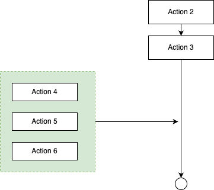
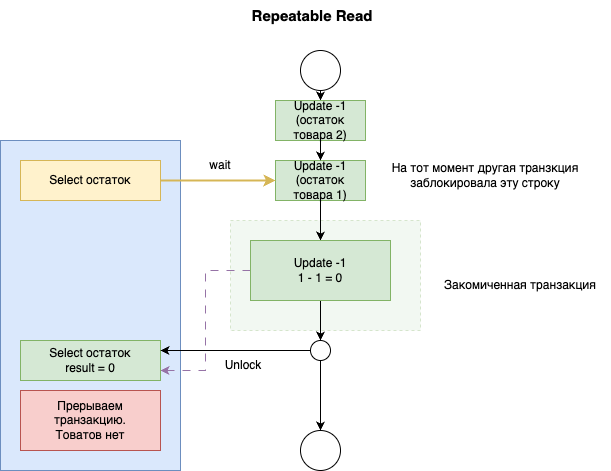
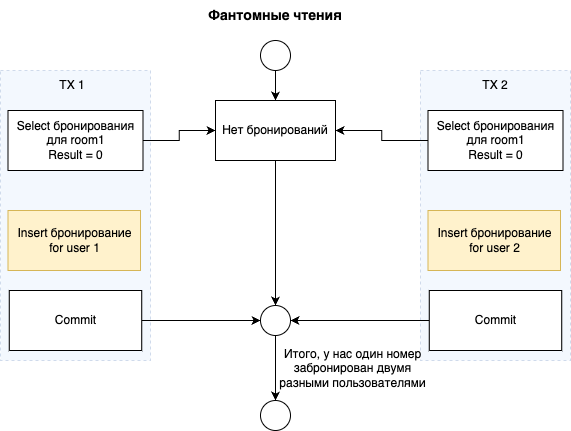
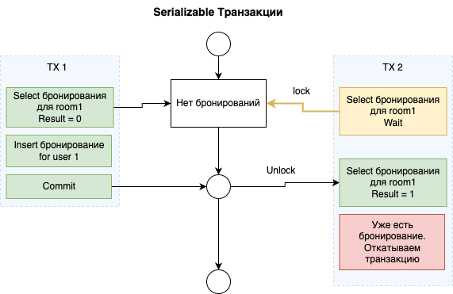

background-image: url(../img/title.svg)

---

background-image: url(../img/rec.svg)

---
background-image: url(../img/topic.svg)

.topic[Работа с базами данных Часть 2]
.tutor[Родион Ступников]
.tutor_desc[Software Engineer]

---

background-image: url(../img/rules.svg)

---
# Темы

.big-list[
* SQL-инъекции
* Транзакции
]

---
# SQL-инъекции
SQL-инъекции - это атаки, при которых злоумышленник внедряет вредоносный SQL-код в SQL-запросы,
выполняемые приложением.
Это может привести к несанкционированному доступу к данным,
уничтожению данных и другим серьезным последствиям.

---
# SQL-инъекции

Опасно:
```go
query := "select * from users where name = '" + name + "'"
query := fmt.Sprintf("select * from users where name = '%s'", name)
```

---
# SQL-инъекции

Потому что в `name` может оказаться что-то наподобие:
```
"jack'; truncate users; select 'pawned"
```

---
# SQL-инъекции

Итоговый вредоносный запрос будет выглядеть так:

```sql
select * from users where name = "jack'; truncate users; select 'pawned"
```

Команда truncate очистит таблицу с пользователями.

---

# SQL-инъекции

Правильный подход - использовать `placeholders` для подстановки значений в SQL:
```go
row := db.QueryRowContext(ctx, "select * from users where name = $1", name)
```

При выполнении запроса с использованием плейсхолдеров,
библиотека базы данных автоматически обрабатывает экранирование и форматирование значений,
чтобы избежать SQL-инъекций. 
Это делает код безопасным и удобным для работы с базой данных.

---
# SQL-инъекции

Однако это не всегда возможно. Так работать не будет:
```go
db.QueryRowContext(ctx, "select * from $1 where name = $2", table, name)
db.QueryRowContext(ctx, "select * from user order by $1 limit 3", order)
```


---
# SQL-инъекции

Другие стратегии защиты:

* Запрещать спец-символы для вводимых данных `' " ; % _ - / * ()`
* Использовать ORM
* Использовать библиотеки для проверки безопасности https://github.com/securego/gosec
* Ограничить у приложения права доступа к базе данных


---
# Транзакции

Транзакция - группа запросов, которые либо выполняются, либо не выполняются вместе.
Внутри транзакции все запросы видят "согласованное" состояние данных.
Транзакцию еще можно представить как историю действий, которые еще не были записаны в основную историю.

---
# Транзакции

Открытая транзакция:

<br/>

.center-image[

]

---
# Транзакции

Коммит транзакции:

.center-image[

]

---
# Транзакции

Откат транзакций:

.center-image[

]

---
# Уровни изолированности транзакций

Уровни изолированности транзакций представляют собой стандарты,
определяющие степень изоляции между параллельно выполняющимися транзакциями в базе данных.

Уровень изолированности определяет, какие операции и данные видны другим транзакциям, 
выполняющимся одновременно, 
и какие блокировки применяются для обеспечения целостности данных.

Выбор уровня изолированности зависит от требований приложения и
баланса между производительностью и изоляцией данных.


---
# READ UNCOMMITTED

Уровень *READ UNCOMMITTED*

Описание: Этот уровень предоставляет самую низкую степень изоляции. Транзакции могут видеть недоопределенные (грязные) данные других транзакций.

Пример ситуации: Транзакция A видит данные, которые были изменены транзакцией B, но еще не зафиксированы.

---
# READ UNCOMMITTED

Проблема: видимость незакомиченных изменений

<br/>

.center-image[

]


---
# READ COMMITTED

Уровень *READ COMMITTED*

*Используется по умолчанию*

Описание: Транзакции видят только зафиксированные данные других транзакций. Этот уровень обеспечивает более высокую изоляцию, чем READ UNCOMMITTED.

Пример ситуации: Транзакция A видит только данные, которые были изменены и зафиксированы транзакцией B.

---
# READ COMMITTED

Проблема: неповторяющееся чтение

.center-image[

]

---
# REPEATABLE READ

Уровень *REPEATABLE READ*

Описание: Транзакции видят только данные, которые были зафиксированы до начала их выполнения. Этот уровень предотвращает даже чтение данных, которые могли бы быть изменены другими транзакциями.

Пример ситуации: Транзакция A, выполняющаяся после начала транзакции B, не видит изменений данных, сделанных транзакцией B.

---
# REPEATABLE READ

Первая успевшая транзакция
накладывает блокировки на прочитанные записи.

<br/>

.center-image[

]

---
# REPEATABLE READ

Вторая транзакция разблокируется,
обнаруживает отсутствие товаров и откатывается.

<br/>

.center-image[

]


---
# Бронирование отелей

Задача: Бронирование номеров в отеле

Представьте, что вы управляете системой бронирования отелей.
Ваша система позволяет клиентам бронировать номера в отелях онлайн. 
Отель предоставляет информацию о доступных номерах и их стоимости.

---
# Бронирование отелей

Проверка доступности номера:

Когда клиент просматривает доступные номера и выбирает один для бронирования,
ваша система выполняет SQL-запрос
для проверки доступности этого номера на указанные даты.

```sql
SELECT * FROM available_rooms 
WHERE hotel_id = 123 
AND date BETWEEN '2023-01-01' AND '2023-01-05'
```

---
# Бронирование отелей

После того как клиент видит доступные номера и выбирает один для бронирования, ваша система регистрирует бронь, используя SQL-запрос

```sql
INSERT INTO reservations (hotel_id, room_number, guest_name,
                          date_from, date_to)
VALUES (123, 101, 'John Doe', '2023-01-01', '2023-01-05')
```

---
# Бронирование отелей

Возможная проблема:

* Предположим, два клиента одновременно пытаются забронировать последний доступный номер в отеле. 
* Когда оба клиента выполняют шаг 1 (проверка доступности номера),
система сообщает им, что номер доступен.
* Затем, оба клиента переходят к шагу 2 (бронирование номера) и 
выполняют Insert-запрос для бронирования этого номера.
* Однако, так как бронирования выполняются параллельно,
оба запроса могут успешно выполниться,
и оба клиента получат подтверждение о бронировании.

<br/>
Это пример *фантомного чтения*. 
Клиенты видели доступные номера и выбрали их, 
но между моментом просмотра и моментом бронирования данные о доступности изменились, 
и номер был забронирован дважды.

---
# Бронирование отелей

.center-image[

]

---
# SERIALIZABLE

Уровень *SERIALIZABLE*

Описание: Этот уровень обеспечивает максимальную изоляцию. Транзакции выполняются так, как если бы они выполнялись последовательно, одна за другой.

Пример ситуации: Транзакция A не видит изменений данных, сделанных транзакцией B, пока транзакция B не завершит свою работу.

---
# SERIALIZABLE

В данном примере транзакция 2 ждет транзакцию 1.
<br/>

.center-image[

]

---
# Уровни изолированности транзакций

Важно помнить:
* Выбор уровня изолированности зависит от требований вашего приложения и баланса между производительностью и изоляцией.
* Более высокие уровни изолированности обеспечивают большую надежность данных, но могут снизить производительность из-за блокировок.


---
# Транзакции в Go

На уровне SQL для транзакций используются отдельные запросы: `BEGIN`, `COMMIT`, `ROLLBACK`.
Уровень изоляции по умолчанию: *READ COMMITTED*
<br><br>
Работа с транзакциями в Go:
```go
tx, err := db.BeginTx(ctx, nil)  // *sql.Tx
if err != nil {
  log.Fatal(err)
}

// далее - обычная работа как с *sql.DB
err := tx.ExecContext(ctx, query1, arg1, arg2)
rows, err := tx.QueryContext(ctx, query2, arg1, arg2)

err := tx.Commit()  // или tx.Rollback()
if err != nil {
  // commit не прошел, данные не изменились
}

// далее объект tx не пригоден для использования
```

http://go-database-sql.org/modifying.html


---
# Транзакции

Следующим образом можно выставить уровень изоляции транзакции:

```go
tx, err := db.BeginTx(ctx, &sql.TxOptions{
    Isolation: sql.LevelRepeatableRead,
    ReadOnly:  false, // Если вы хотите, чтобы транзакция была только для чтения, установите true
})
if err != nil {
    log.Fatal(err)
}

// Далее можно выполнять операции внутри транзакции, такие как ExecContext() или QueryContext().

err := tx.Commit() // или tx.Rollback()
if err != nil {
    // Если произошла ошибка, обработайте её
}

```

---
# Практика

Возвращаемся к примеру с бронированием отелей

Выполнить практическую задачу:
https://github.com/OtusGolang/webinars_basic_practical_part/tree/master/29-databases-3/serializable_tx


---

background-image: url(../img/questions.svg)

---

background-image: url(../img/poll.svg)

---

background-image: url(../img/next_webinar.svg)
.announce_date[1 января]
.announce_topic[Тема следующего вебинара]

---
background-image: url(../img/thanks.svg)

.tutor[Лектор]
.tutor_desc[Должность]
